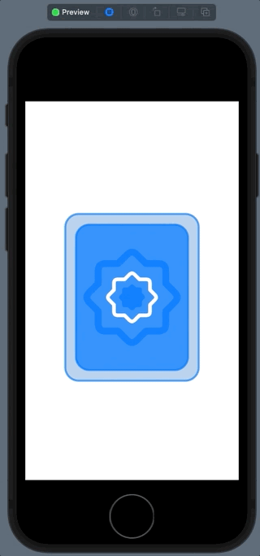
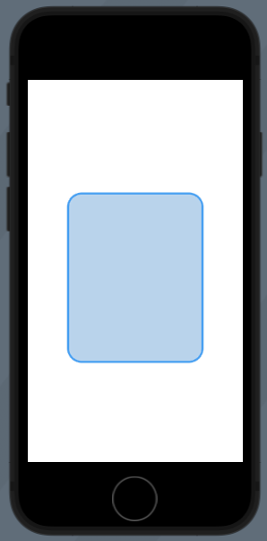
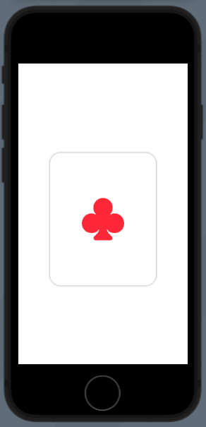
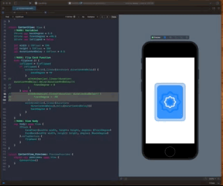
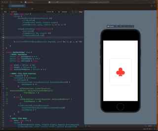

# Flipping a Card



**ContentView**

```swift
import SwiftUI

struct CardFront : View {
    let width : CGFloat
    let height : CGFloat
    @Binding var degree : Double

    var body: some View {
        ZStack {
            RoundedRectangle(cornerRadius: 20)
                .fill(.white)
                .frame(width: width, height: height)
                .shadow(color: .gray, radius: 2, x: 0, y: 0)

            Image(systemName: "suit.club.fill")
                .resizable()
                .frame(width: 80, height: 80)
                .foregroundColor(.red)

        }.rotation3DEffect(Angle(degrees: degree), axis: (x: 0, y: 1, z: 0))
    }
}

struct CardBack : View {
    let width : CGFloat
    let height : CGFloat
    @Binding var degree : Double

    var body: some View {
        ZStack {
            RoundedRectangle(cornerRadius: 20)
                .stroke(.blue.opacity(0.7), lineWidth: 3)
                .frame(width: width, height: height)

            RoundedRectangle(cornerRadius: 20)
                .fill(.blue.opacity(0.2))
                .frame(width: width, height: height)
                .shadow(color: .gray, radius: 2, x: 0, y: 0)

            RoundedRectangle(cornerRadius: 20)
                .fill(.blue.opacity(0.7))
                .padding()
                .frame(width: width, height: height)

            RoundedRectangle(cornerRadius: 20)
                .stroke(.blue.opacity(0.7), lineWidth: 3)
                .padding()
                .frame(width: width, height: height)

            Image(systemName: "seal.fill")
                .resizable()
                .frame(width: 40, height: 40)
                .foregroundColor(.blue.opacity(0.7))

            Image(systemName: "seal")
                .resizable()
                .frame(width: 80, height: 80)
                .foregroundColor(.white)

            Image(systemName: "seal")
                .resizable()
                .frame(width: 150, height: 150)
                .foregroundColor(.blue.opacity(0.7))

        }.rotation3DEffect(Angle(degrees: degree), axis: (x: 0, y: 1, z: 0))

    }
}

struct ContentView: View {
    //MARK: Variables
    @State var backDegree = 0.0
    @State var frontDegree = -90.0
    @State var isFlipped = false

    let width : CGFloat = 200
    let height : CGFloat = 250
    let durationAndDelay : CGFloat = 0.3

    //MARK: Flip Card Function
    func flipCard () {
        isFlipped = !isFlipped
        if isFlipped {
            withAnimation(.linear(duration: durationAndDelay)) {
                backDegree = 90
            }
            withAnimation(.linear(duration: durationAndDelay).delay(durationAndDelay)){
                frontDegree = 0
            }
        } else {
            withAnimation(.linear(duration: durationAndDelay)) {
                frontDegree = -90
            }
            withAnimation(.linear(duration: durationAndDelay).delay(durationAndDelay)){
                backDegree = 0
            }
        }
    }
    //MARK: View Body
    var body: some View {
        ZStack {
            CardFront(width: width, height: height, degree: $frontDegree)
            CardBack(width: width, height: height, degree: $backDegree)
        }.onTapGesture {
            flipCard ()
        }
    }
}
```

## CardBack

We start by drawing the back of the card like this:

**CardBack**

```swift
struct CardBack : View {
    let width : CGFloat
    let height : CGFloat

    var body: some View {
        ZStack {
            RoundedRectangle(cornerRadius: 20)
                .stroke(.blue.opacity(0.7), lineWidth: 3)
                .frame(width: width, height: height)

            RoundedRectangle(cornerRadius: 20)
                .fill(.blue.opacity(0.2))
                .frame(width: width, height: height)
                .shadow(color: .gray, radius: 2, x: 0, y: 0)
        }
    }
}

struct ContentView: View {
    let width : CGFloat = 200
    let height : CGFloat = 250

    var body: some View {
        ZStack {
            CardBack(width: width, height: height)
        }
    }
}
```



## CardFront

**CardFront**

```swift
struct CardFront : View {
    let width : CGFloat
    let height : CGFloat

    var body: some View {
        ZStack {
            RoundedRectangle(cornerRadius: 20)
                .fill(.white)
                .frame(width: width, height: height)
                .shadow(color: .gray, radius: 2, x: 0, y: 0)

            Image(systemName: "suit.club.fill")
                .resizable()
                .frame(width: 80, height: 80)
                .foregroundColor(.red)

        }
    }
}

struct ContentView: View {
    let width : CGFloat = 200
    let height : CGFloat = 250

    var body: some View {
        ZStack {
            CardFront(width: width, height: height)
        }
    }
}
```



## The Animations

The rotation is a 90° rotation about the y-axis. 

```swift
rotation3DEffect(Angle(degrees: degree), axis: (x: 0, y: 1, z: 0))
```

Here is the rotation for just the backcard:



Then we can repeat the same thing, but only for the front card:



The way we get these to work is we need to do one animation first, and then when it completes start the second.

And of course this is all done by manipulating state like this:

```swift
struct ContentView: View {
    @State var backDegree = 0.0
    @State var frontDegree = -90.0
    @State var isFlipped = false
    
        var body: some View {
        ZStack {
            CardFront(width: width, height: height, degree: $frontDegree) // bind
            CardBack(width: width, height: height, degree: $backDegree) // bind
        }.onTapGesture {
            flipCard ()
        }
    }
```

By binding the cards to the front and back degrees, and then adding the `rotating3DEffect` to the `ZStack` of the card:

```swift
struct CardFront : View {
    let width : CGFloat
    let height : CGFloat
    @Binding var degree : Double

    var body: some View {
        ZStack {
            ...
        }.rotation3DEffect(Angle(degrees: degree), axis: (x: 0, y: 1, z: 0))
    }
}
```

SwiftUI is going to animate those changes between `0` and `90` degrees as soon as the change in `degree` state changes.

We then initiate and track the state of the flip like this:

```swift
func flipCard () {
    isFlipped = !isFlipped
    if isFlipped {
        withAnimation(.linear(duration: durationAndDelay)) {
            backDegree = 90
        }
        withAnimation(.linear(duration: durationAndDelay).delay(durationAndDelay)){
            frontDegree = 0
        }
    } else {
        withAnimation(.linear(duration: durationAndDelay)) {
            frontDegree = -90
        }
        withAnimation(.linear(duration: durationAndDelay).delay(durationAndDelay)){
            backDegree = 0
        }
    }
}
```

The animations are always paired. When goes goes to `0` the other goes to `+/- 90`. And the second animation starts just after the first animation finishes.

Voila 🎉

## Key points

- Animations are driving by state
- You change state with taps and gestures
- Stop thinking about doing animations 
 - Instead think of setting them up for when certain things happen


### Links that help

- [Article1](https://betterprogramming.pub/card-flip-animation-in-swiftui-45d8b8210a00)
