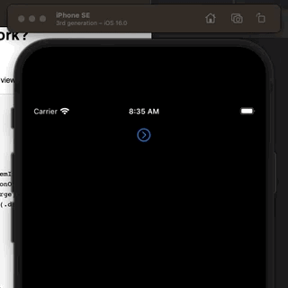
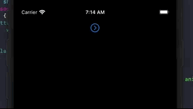
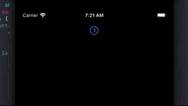
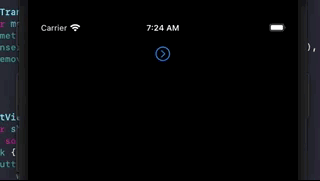

# How animations work?

[SwiftUI Landmark animations](https://developer.apple.com/tutorials/swiftui/animating-views-and-transitions)

When we change our state, Swift updates our view rather abruptly like this:

```swift
struct ContentView: View {
    @State var showDetail = false
    var body: some View {
        VStack {
            Button {
                showDetail.toggle()
            } label: {
                Label("Graph", systemImage: "chevron.right.circle")
                    .labelStyle(.iconOnly)
                    .imageScale(.large)
                    .rotationEffect(.degrees(showDetail ? 90 : 0))
                    .padding()
            }

            if showDetail {
                ImageView()
            }
            Spacer()
        }
    }
}
```



If we want to animate changes of state we have two options:

- implicit, and
- explicit

## Implicit animations

Implicit animations are those changes of state that we animate through the `animation()` modifier.

> When you use the `animation(_:)` modifier on an equatable view, SwiftUI animates any changes to animatable properties of the view. A view’s color, opacity, rotation, size, and other properties are all animatable. When the view isn’t equatable, you can use the `animation(_:value:)` modifier to start animations when the specified value changes.

For example to animate the orientation and size of the chevron when the button is pressed we tie the state of the chevron to `showDetail` and then add it to the `animation()` modifier:

For example, we could make the label bigger based on that state change too like this:

```swift
Button {
    showDetail.toggle()
} label: {
    Label("Graph", systemImage: "chevron.right.circle")
        .labelStyle(.iconOnly)
        .imageScale(.large)
        .rotationEffect(.degrees(showDetail ? 90 : 0)) //
        .scaleEffect(showDetail ? 1.5 : 1) //
        .padding()
        .animation(.easeInOut, value: showDetail) //
}
```


## Explicit animations

If implicit animations are how we can animate views, explicit animations how we animate changes of state.

Let's remove the implicit `.animation(.easeInOut, value: showDetail)` animation. And explicitly animate the change of state with `withAnimation` like this:

```swift
Button {
    withAnimation {
        showDetail.toggle()
    }
}
```

When we do this, all views affected by this change of state are automatically animated. In this case both the label image and the appearance of `ImageView`.



You can play with the duration of the animation like this:

```swift
Button {
    withAnimation(.easeInOut(duration: 4)) {
        showDetail.toggle()
    }
}
```
So the difference between implicit and explicit animations is:

- implicit is for adding automated animations to views, while
- explicit animations are for animations all views affected by a change in state

## Customizing View Transitions

By default, views transition on- and offscreen by fading in and out. You can control this transition by using the `transition(_:)` modifier:

```swift
if showDetail {
    ImageView()
        .transition(.slide)
}
```



Use the `asymmetric(insertion:removal:)` modifier to provide different transitions for when the view appears and disappears:

```swift
extension AnyTransition {
    static var moveAndFade: AnyTransition {
        .asymmetric(
            insertion: .move(edge: .trailing).combined(with: .opacity),
            removal: .scale.combined(with: .opacity)
        )
    }
}

if showDetail {
    ImageView()
        .transition(.moveAndFade)
}
```


