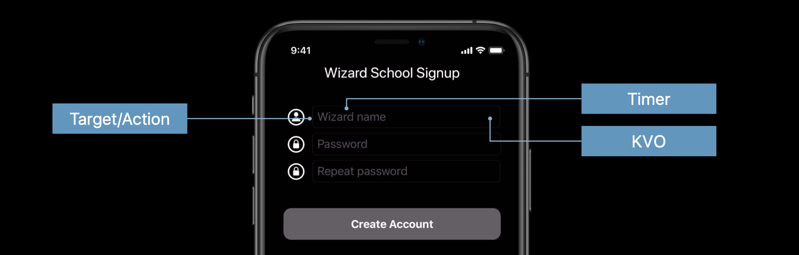
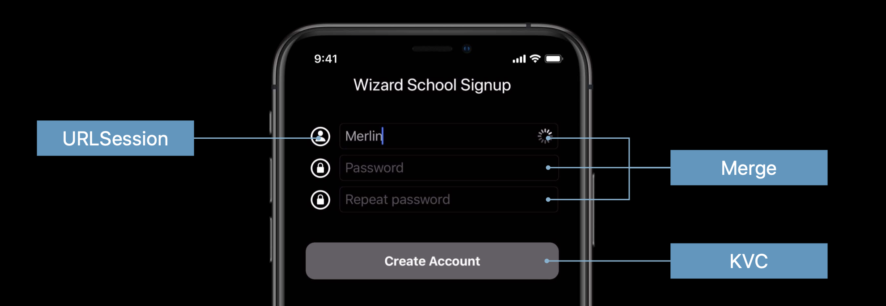

# Getting Started with Combine

## What is Combine?

[Combine](https://developer.apple.com/documentation/combine) is a unified Swift API framework for processing events over time. Events include:

- Target/Action
- Notification center
- URLSession
- Key-Value observing (KVO)
- Ad-hoc callbacks

And what Combine does is it takes all these events, streams them into one, and let's you add logic to decide how they get processed and ultimately how they affect the state of our UI controls.

## Where would I use it?

Let's say we are building wizard registration app. And before a wizard can create an account we need to check that:

- the wizard's name is unique (asynchronous call to backend server)
- they have entered a valid password, and
- they have correctly entered the repeat password twice

There is a lot of asynchronous eventing going on here. First we need to listen for when the user taps the text field via a target-action. Then we don't want to call the backend on every keypress as a wizard types in their username - set we setup a timer to debounce and only send the request every couple seconds. Then we might use KVO (Key Value Observing) to notify ourselves that the value of the wizard field has changed, and run additional processing logic to see if the other conditions have been met.



What Combine does, it is takes all these different events, logic, and timing, and combines them into one stream, that we can query, and ask: "Have all these conditions been met."



- It can listen for the result of an asynchronous call to `URLSession`.
- It can merge the validation results from the username, password, and repeat password fields
- And then it can use that result to update the state of the create account button via KVC (Key Value Coding).

But before we get into a full on example like this, let's start with an even simpler example.

## How it works

Combine is built around three main abstractions:

- Publishers
- Operators, and
- Subscribers


### Publishers

Publishers publish events. Say for example that we want to be notified everytime a new blog is ready to be published. We could a built in publisher like `NotificationCenter` to fire an event every time a new blog post is published.

```swift
extension Notification.Name {
    static let newBlogPost = Notification.Name("newPost")
}

struct BlogPost {
    let title: String
}

// Create a publisher
let publisher = NotificationCenter.Publisher(center: .default, name: .newBlogPost, object: nil)
 .map { (notification) -> String? in
     return (notification.object as? BlogPost)?.title ?? ""
}
```

### Operators

Operators take the output of publishers, and transform them into other data types downstream subscribers can understand. Like strings.

In this case for example, our `NotificationCenter` emits `Notification` as it's output. We need to convert that into a string based off the title of the blog post.


Operators do that though operations like `map`.

```swift
 .map { (notification) -> String? in
     return (notification.object as? BlogPost)?.title ?? ""
}
```

### Subscribers

Once we have our publishers and operators mapped, we are ready to subscribe. Subscription is a two step process. First we need to create the subscriber. Then we need to subscribe that subscriber to the publisher.

```swift
// Create a subscriber
let subscriber = Subscribers.Assign(object: subscribedLabel, keyPath: \.text)
publisher.subscribe(subscriber)
```

`Assign` is one way we take a UIControl like `UILabel`, and using KVC bind the publishers output to that labels `text` property.

Now whenever a new blog post is published, our label automatically gets the update.


### Source Code

**ViewController.swift**

```swift
import UIKit
import Combine

extension Notification.Name {
    static let newBlogPost = Notification.Name("newPost")
}

struct BlogPost {
    let title: String
}

class ViewController: UIViewController {

    @IBOutlet var blogTextField: UITextField!
    @IBOutlet var publishButton: UIButton!
    @IBOutlet var subscribedLabel: UILabel!
    
    override func viewDidLoad(  ) {
        super.viewDidLoad()

        publishButton.addTarget(self, action: #selector(publishButtonTapped), for: .primaryActionTriggered)
        
        // Create a publisher
        let publisher = NotificationCenter.Publisher(center: .default, name: .newBlogPost, object: nil)
         .map { (notification) -> String? in
             return (notification.object as? BlogPost)?.title ?? ""
         }
        
        // Create a subscriber
        let subscriber = Subscribers.Assign(object: subscribedLabel, keyPath: \.text)
        publisher.subscribe(subscriber)
    }
    
    @objc func publishButtonTapped(_ sender: UIButton) {
        // Post the notification
        let title = blogTextField.text ?? "Coming soon"
        let blogPost = BlogPost(title: title)
        NotificationCenter.default.post(name: .newBlogPost, object: blogPost)
    }
}
```

### The Publisher

First we’d create something called a `Publisher`.

```swift
let publisher = NotificationCenter.Publisher(center: .default, name: .newBlogPost, object: nil)
 .map { (notification) -> String? in
     return (notification.object as? BlogPost)?.title ?? ""
 }
```

A publisher is anything that can emit events. In this case we are using `NotificationCenter`. `NotificationCenter` which sends out notifications.

### The Operator

Because our publisher emits `Notification`, we need to convert that in something our subscribers can understand. For that we have operators.

Operators take the output from publishers, and republish them while transforming them along the way. In this case, we want the title of the new blog post - a `String`. 


So in this case we use the `map` operator on our `notification` to convert the blog post we receive as part of the event it into a `String`.

```swift
.map { (notification) -> String? in
	return (notification.object as? BlogPost)?.title ?? ""
}
```

### The Subscriber

Now all we have to do is subscribe.

```swift
let subscriber = Subscribers.Assign(object: subscribedLabel, keyPath: \.text)
publisher.subscribe(subscriber)
```

Subscribers subscribe to publishers they are interested in receiving events from, and bind whatever the publisher is sending, to whatever control we want via a keypath - in this case the label's `\.text`.

We then subscribe our subscriber to the publisher like this.

```swift
publisher.subscribe(subscriber)
```

### Fire the event

We can fire the notification when the user taps the publish button. We grab the text from the text field, create a `BlogPost` using that text, and then fire it through the `NotificationCenter` which will in turn update the label.

```swift
@objc func publishButtonTapped(_ sender: UIButton) {
    // Post the notification
    let title = blogTextField.text ?? "Coming soon"
    let blogPost = BlogPost(title: title)
    NotificationCenter.default.post(name: .newBlogPost, object: blogPost)
}
```

### Summary

So in summary:

- Combine is a framework for processing events.
- It leverages existing technologies like NotificationCenter, KVO and KVC to publish and send events.
- A publisher is anything that conforms to the `Publish` pro tertocol and can send event.
 - Examples of publishers in Foundation include `Timer`, `NotificationCenter`, and `URLSession`.
- Operators take the output of publishers and map them into more digestable forms.
- Subscribers subscribe to publishers and receive their downstream events.


## Another example - Terms & Conditions

So here is an app that only enables the submit button once both terms and conditions switches have been accepted, and the user enters a valid username in the text field.

A good way to start building this would be to define some outlets from our Storyboard.

```swift
    @IBOutlet var termsSwitch: UIStackView!
    @IBOutlet var privacySwitch: UISwitch!
    @IBOutlet var nameField: UITextField!
    @IBOutlet var submitButton: UIButton!
```

Define some properties to hold state.

```swift
private var acceptedTerms: Bool = false
private var acceptedPrivacy: Bool = false
private var name: String = ""
```

And then the target-action methods for the two switches and the text field for whenever something changes.

```swift
@IBAction private func acceptTerms(_ sender: UISwitch) {
    acceptedTerms = sender.isOn
}

@IBAction private func acceptPrivacy(_ sender: UISwitch) {
    acceptedPrivacy = sender.isOn
}

@IBAction private func nameChanged(_ sender: UITextField) {
    name = sender.text ?? ""
}
```

Now if we weren’t using Combine, this is where we could create some method name `configureView`, and call it from the `didSet` observer on each property.

```swift
private var acceptedTerms: Bool = false {
  didSet { configureView() }
}
```

And then add the logic there to check and see if all the conditions have been met. But we are here to learn Combine. So let’s see how using Combine would work.

### Import the framework

```swift
import Combine
```

### Turn properties into publishers

The way we turn properties into publishers is by adding the `@Published` keyword to each property.

```swift
@Published private var acceptedTerms: Bool = false
@Published private var acceptedPrivacy: Bool = false
@Published private var name: String = ""
```

The `@Published` keyword is a property wrapper, which creates a publisher for any property of a class.

> You can’t use it with value types like `struct`. It can only be used on `class`.

What’s great about `@Published` is you can still access variables just as if it were a regular property.

```swift
@Published var password: String = ""
self.password = "123"
let newPassword = self.password

let printerSubscription = $password.sink {
    print("The published value is \($0)")
}
```

But when you use the `$` prefix, you get access to the published wrapper, which lets you sign yourself as a subscriber, and be notified when any values change like this.

```swift
// Keep a reference to the subscription so it's
// only cancelled when we are deallocated.
private var termsStream: AnyCancellable?   

// Simple sink subscription to print value
termsStream = $acceptedTerms.sink { value in
  print("Received \(value)")
}
```

### CombineLatest

In order to enable the submit button we need to ‘combine’ the results of three publishers:

acceptedTerms
acceptedPrivacy, and
name

The we way do that in Combine is to use `CombineLatest`. `CombineLatest` is a publisher that takes the results from multiple publishers, and combines them and their latest values into one.

```swift
Publishers.CombineLatest3($acceptedTerms, $acceptedPrivacy, $name)
```

Note how we are using the binding `$` here. They gives us a tuple of type `(Bool, Bool, String)`. A subscribe to this publisher will then receive these values and is able to use them for processing.

### Map Operator

Next we can use the map operation to convert our tuple into a single Bool indicating whether we can enable the submit button.

```swift
.map { terms, privacy, name in
  terms && privacy && !name.isEmpty
}
```

### Type Erasure

Publishers can have really complicated signatures. And if we have to expose those signatures to the outside world, we would end up with some really messy and wacky APIs. So to keep our APIs simple and neat, Apple create the `eraseToAnyPublisher()` method expose only the generic type `AnyPublisher<Bool, Never>` to the outside world, and hide the internals.

### Keypath Assign Subscription

Last step. Here we create the subscription to receive from our publisher and assign the output to the state of the submit button. 

Because we are working with classes, don’t want the stream to be cancelled until the view control goes away we store a reference to our subscription as a type `AnyCancellable`.

```swift
private var stream: AnyCancellable?
```

This also prevents memory leaks from occurring, and ensures the subscription gets nicely cleaned up later on `deinit()`.

Then we create the subscription to our publisher in `viewDidLoad`.

```swift
stream = validToSubmit
  .receive(on: RunLoop.main)
  .assign(to: \.isEnabled, on: submitButton)
```

Since we’re interacting with UIKit, we use receive(on:) to make sure we receive from our publisher on the main run loop. The assign(to:) operator assigns the received value to a keypath of an object. We use it to assign the received Bool to the isEnabled property of the submit button.

And that’s basically it! When both switches are on, and there is text in the text field, the submit button will be enabled and the text will be blue.

### Debugging

I am not really sure yet best how to debug Combine. Until then I simply rely on good on print statements.

```swift
.map { terms, privacy, name in
                print("foo - terms: \(terms) privacy: \(privacy) name: \(name)")
                return terms && privacy && !name.isEmpty
            }.eraseToAnyPublisher()
```

### Full source

```swift
import UIKit
import Combine

class ViewController: UIViewController {

    @IBOutlet var termsSwitch: UIStackView!
    @IBOutlet var privacySwitch: UISwitch!
    @IBOutlet var nameField: UITextField!
    @IBOutlet var submitButton: UIButton!
    
    // Define publishers
    @Published private var acceptedTerms = false
    @Published private var acceptedPrivacy = false
    @Published private var name = ""
    
    private var stream: AnyCancellable?
    
    override func viewDidLoad() {
        super.viewDidLoad()
        nameField.delegate = self
        
        stream = validToSubmit
            .receive(on: RunLoop.main)
            .assign(to: \.isEnabled, on: submitButton)
    }

    private var validToSubmit: AnyPublisher<Bool, Never> {
        return Publishers.CombineLatest3($acceptedTerms, $acceptedPrivacy, $name)
            .map { terms, privacy, name in
                print("foo - terms: \(terms) privacy: \(privacy) name: \(name)")
                return terms && privacy && !name.isEmpty
            }.eraseToAnyPublisher()
    }
    
    @IBAction func acceptTerms(_ sender: UISwitch) {
        acceptedTerms = sender.isOn
    }
    
    @IBAction func acceptPrivacy(_ sender: UISwitch) {
        acceptedPrivacy = sender.isOn
    }
    
    @IBAction func nameChanged(_ sender: UITextField) {
        name = sender.text ?? ""
    }
    
    @IBAction func submitAction(_ sender: UIButton) {
        print("foo - Submit: \(name)")
    }
    
}

extension ViewController: UITextFieldDelegate {
    func textFieldShouldReturn(_ textField: UITextField) -> Bool {
        textField.resignFirstResponder()
        return true;
    }
}
```

	
### Links that help

- [Introducing Combine - WWDC 2019](https://developer.apple.com/videos/play/wwdc2019/722)
- [Combine in Practice - WWDC 2019](https://developer.apple.com/videos/play/wwdc2019/721/)
- [Use Your Loaf - Getting started with Combine](https://useyourloaf.com/blog/getting-started-with-combine/)
- [AvanderLee - Getting started with Combine](https://www.avanderlee.com/swift/combine/)


