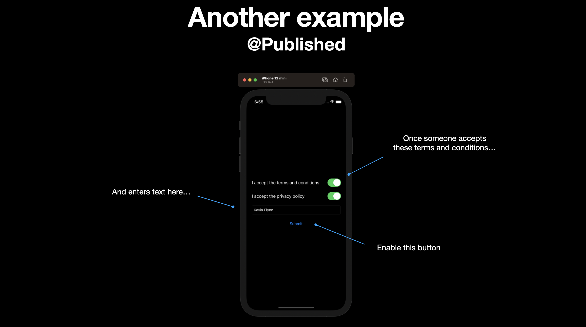
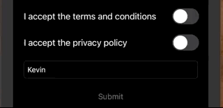
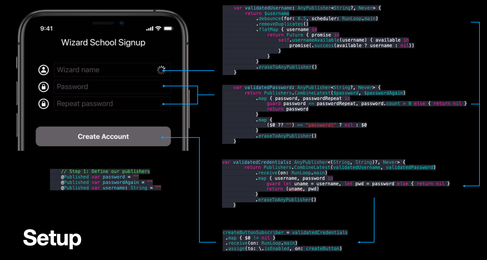
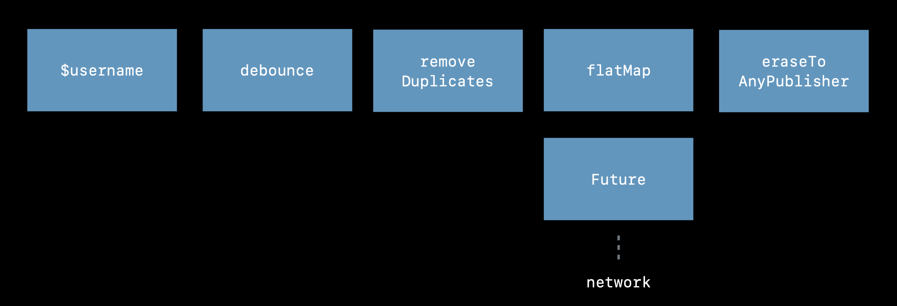

# Getting Started with Combine

## What is Combine?

[Combine](https://developer.apple.com/documentation/combine) is a unified Swift API framework for processing events over time. What kind of events? Mostly asynchronous one. Kind kind that fire continuously as our applications are running, making us want to update our UI.

- Target/Action
- Notification center
- URLSession
- Key-Value observing (KVO)
- Ad-hoc callbacks

What Combine does is it takes all these events, streams them into one chain of flow, and then enables you to operate on them. Adding logic, determining outcomes, and then ultimately decide where and how to update your UI.

## Where would I use it?

Let's say we are building wizard registration app. And before a wizard can create an account we need to check that:

- the wizard's name is unique (asynchronous call to backend server)
- they have entered a valid password, and
- they have correctly entered the repeat password twice

There is a lot of asynchronous eventing going on here. First we need to listen for when the user taps the text field via a target-action. Then we don't want to call the backend on every keypress as a wizard types in their username - set we setup a timer to debounce and only send the request every couple seconds. Then we might use KVO (Key Value Observing) to notify ourselves that the value of the wizard field has changed, and run additional processing logic to see if the other conditions have been met.


What Combine does, it is takes all these different events, logic, and timing, and combines them into one stream, that we can query, and ask: "Have all these conditions been met."


- It can listen for the result of an asynchronous call to `URLSession`.
- It can merge the validation results from the username, password, and repeat password fields
- And then it can use that result to update the state of the create account button via KVC (Key Value Coding).

But before we get into a full on example like this, let's start with an even simpler example to see the mechanics behind how it works.

## How does it work?

In this simple example we will use Combine to:

- update a label
- when a button is pressed
- with the contents of the text field


Combine is built around three main abstractions:

- Publishers
- Operators, and
- Subscribers

### Publishers

Publishers publish, or fire the events we are interested in receiving. Say for example that we want to be notified everytime a new blog post is ready to be published. We could a create a `NotificationCenter` based publisher and then fire it when the publish button is pressed.

```swift
extension Notification.Name {
    static let newBlogPost = Notification.Name("newPost")
}

struct BlogPost {
    let title: String
}

// Create a publisher
let publisher = NotificationCenter.Publisher(center: .default, name: .newBlogPost, object: nil)
 .map { (notification) -> String? in
     return (notification.object as? BlogPost)?.title ?? ""
}
```

### Operators

Operators take the output of publishers, and transform them into other data types downstream subscribers can understand. Like strings.

In this case for example, our `NotificationCenter` emits `Notification` as it's output. We need to convert that into a string based off the title of the blog post.


Operators do that though operations like `map`, which we can conveniently tack onto publishers with a closure.

```swift
.map { (notification) -> String? in
     return (notification.object as? BlogPost)?.title ?? ""
}
```

### Subscribers

Once we have our publishers and operators mapped, we are ready to subscribe. Subscription is a two step process. First we need to create the subscriber. Then we need to subscribe that subscriber to the publisher.

```swift
// Create a subscriber
let subscriber = Subscribers.Assign(object: subscribedLabel, keyPath: \.text)
publisher.subscribe(subscriber)
```

### Fire the event

We can fire the notification when the user taps the publish button. We grab the text from the text field, create a `BlogPost` using that text, and then fire it through the `NotificationCenter` which will in turn update the label.

```swift
@objc func publishButtonTapped(_ sender: UIButton) {
    // Post the notification
    let title = blogTextField.text ?? "Coming soon"
    let blogPost = BlogPost(title: title)
    NotificationCenter.default.post(name: .newBlogPost, object: blogPost)
}
```


### Source

**ViewController.swift**

```swift
import UIKit
import Combine

extension Notification.Name {
    static let newBlogPost = Notification.Name("newPost")
}

struct BlogPost {
    let title: String
}

class ViewController: UIViewController {

    @IBOutlet var blogTextField: UITextField!
    @IBOutlet var publishButton: UIButton!
    @IBOutlet var subscribedLabel: UILabel!
    
    override func viewDidLoad(  ) {
        super.viewDidLoad()

        publishButton.addTarget(self, action: #selector(publishButtonTapped), for: .primaryActionTriggered)
        
        // Create a publisher
        let publisher = NotificationCenter.Publisher(center: .default, name: .newBlogPost, object: nil)
         .map { (notification) -> String? in
             return (notification.object as? BlogPost)?.title ?? ""
         }
        
        // Create a subscriber
        let subscriber = Subscribers.Assign(object: subscribedLabel, keyPath: \.text)
        publisher.subscribe(subscriber)
    }
    
    @objc func publishButtonTapped(_ sender: UIButton) {
        // Post the notification
        let title = blogTextField.text ?? "Coming soon"
        let blogPost = BlogPost(title: title)
        NotificationCenter.default.post(name: .newBlogPost, object: blogPost)
    }
}
```

## The @Published Attribute



Manually firing events through `NotificationCenter` is one way we can publish events through Combine. Another, is by leveraging the `@Published` attribute on a property.

### Define your publishers

`@Published` is a property wrapper that adds a publisher to any given property.

```swift
@Published private var acceptedTerms = false
@Published private var acceptedPrivacy = false
@Published private var name = ""
```

By adding this attribute to state properties you want to track, you are enabling these properties to publish themselves. Or emit messages whenever their state changes.

### Combine publishers into a stream

With this publishers now defined, we can combine them into a single, nice, easy parse publisher stream.

```swift
private var validToSubmit: AnyPublisher<Bool, Never> {
    return Publishers.CombineLatest3($acceptedTerms, $acceptedPrivacy, $name)
        .map { terms, privacy, name in
            return terms && privacy && !name.isEmpty
        }.eraseToAnyPublisher()
}
```

This publisher takes three properities, accesses their property wrappers via the binding `$`, and then uses the `map` operator to combine their output into one `Bool` value which it then returns. `eraseToAnyPublisher` converts the map API into our `<Bool, Never>` API so we don't expose the internals of mapping.

### Define your subscribers

Because this is a class based technology, we need to worry about memory leaks. By defining a `AnyCancellable` variable property we ensure that our subscriber will be cleaned up with this view controller goes away.

```
private var buttonSubscriber: AnyCancellable?
```

### Subscribe

We then connect our subscriber to our publisher like this.

```swift
buttonSubscriber = validToSubmit
    .receive(on: RunLoop.main)
    .assign(to: \.isEnabled, on: submitButton)
```

This takes our publisher stream, `validToSubmit`, and says:

- `.receive(on: RunLoop.main)` make sure we aren't blocking the main thread on the UI
- `.assign(to: \.isEnabled, on: submitButton)` and assign the `Bool` output to the `isEnabled` property of our submit buttom.

That's the magic. That's where it all comes together. This is where we map the output of our publisher stream to the state of one of our controls.

All together it looks like this.



**ViewController.swift**

```swift
//
//  ViewController.swift
//  TermsAndConditions
//
//  Created by jrasmusson on 2021-05-21.
//

import UIKit
import Combine

class ViewController: UIViewController {

    @IBOutlet var acceptedSwitch: UISwitch!
    @IBOutlet var privacySwitch: UISwitch!
    @IBOutlet var nameField: UITextField!
    @IBOutlet var submitButton: UIButton!
    
    // Define publishers
    @Published private var acceptedTerms = false
    @Published private var acceptedPrivacy = false
    @Published private var name = ""
    
    // Combine publishers into single stream
    private var validToSubmit: AnyPublisher<Bool, Never> {
        return Publishers.CombineLatest3($acceptedTerms, $acceptedPrivacy, $name)
            .map { terms, privacy, name in
                return terms && privacy && !name.isEmpty
            }.eraseToAnyPublisher()
    }

    // Define subscriber
    private var buttonSubscriber: AnyCancellable?
    
    override func viewDidLoad() {
        super.viewDidLoad()
        nameField.delegate = self
        
        // Hook subscriber up to publisher
        buttonSubscriber = validToSubmit
            .receive(on: RunLoop.main)
            .assign(to: \.isEnabled, on: submitButton)
    }
    
    @IBAction func acceptTerms(_ sender: UISwitch) {
        acceptedTerms = sender.isOn
    }
    
    @IBAction func acceptPrivacy(_ sender: UISwitch) {
        acceptedPrivacy = sender.isOn
    }
    
    @IBAction func nameChanged(_ sender: UITextField) {
        name = sender.text ?? ""
    }
    
    @IBAction func submitAction(_ sender: UIButton) {
    }
}

extension ViewController: UITextFieldDelegate {
    func textFieldShouldReturn(_ textField: UITextField) -> Bool {
        textField.resignFirstResponder()
        return true;
    }
}
```

## Back to Wizardy School

OK. So let's return now to Wizardry school and see how this combine magic can actually work.



The power of combine comes into play when you can see how various publication streams can be combined and then bound to a single state of a UI control.

We start by defining various publishers (`@Published`) for view controller.

```swift
@Published var password = ""
@Published var passwordAgain = ""
@Published var username: String = ""
```

We then set or change the state of these properties when the input changes on their respective text fields via the `UITextFieldDelegate`.

```swift
extension ViewController: UITextFieldDelegate {
    func textField(_ textField: UITextField, shouldChangeCharactersIn range: NSRange, replacementString string: String) -> Bool {
        let textFieldText = textField.text ?? ""
        let text = (textFieldText as NSString).replacingCharacters(in: range, with: string)
        
        if textField == nameTextField { username = text }
        if textField == passwordTextField { password = text }
        if textField == repeatTextField { passwordAgain = text }
        
        return true
    }
}
```

### Validating the username

When the username changes, we want to validate it by calling our backend service asynchronously and seeing if it is available. We can do that through this code here.

```swift
var validatedUsername: AnyPublisher<String?, Never> {
    return $username
        .debounce(for: 0.5, scheduler: RunLoop.main)
        .removeDuplicates()
        .flatMap { username in
            return Future { promise in
                self.usernameAvailable(username) { available in
                    promise(.success(available ? username : nil))
                }
            }
        }
        .eraseToAnyPublisher()
}
```

This validation publisher binds to the `$username` property wrapper, which let us then do processing on this stream.

The first things we do is prevent our backend from being overwhelmed with calls everytime the user types in a new key. This is called a `debounce` and by setting it equal to `0.5` we limit the calls to our backend every half second while running on the main thread.

```swift
.debounce(for: 0.5, scheduler: RunLoop.main)
```

If the user types the same username within the duration of the debounce window, there is no point on checking the same username again, so we strip those out by removing the duplicates.

```swift
.removeDuplicates()
```

This smoothes our signal out. But we haven’t yet handled any of the asynchronous events. What we want to do is hit our server and find out if this password is valid. For that we have an existing function in our application called `usernameAvailable()`.

```swift
func usernameAvailable(_ username: String, completion: (Bool) -> Void) {
    completion(true) // Our fake asynchronous backend service
}
```

Here we are just stubbing out or faking a valid return value of `true` pretending to hit our backend service. This `true` gets returned as a `Bool` in a closure which can be used in a `Future` and a `Promise` to return the `username` original set in the text field.

```swift
return Future { promise in
    self.usernameAvailable(username) { available in
        promise(.success(available ? username : nil))
    }
}
```

We'll get into `Future` and `Promise` more later. For now just understand that `Future` allows us to do things asynchronously. And a `Promise` is nothing more than a Swift `Result` type from which we can return `Success` or `Failure`.

And then to hide the interals and ensure it can be consumed by any, we finish off with `.eraseToAnyPublisher()`.

Pictorially, this event processing looks like this.



### Validating the password

```swift
var validatedPassword: AnyPublisher<String?, Never> {
    return Publishers.CombineLatest($password, $passwordAgain)
        .map { password, passwordRepeat in
            guard password == passwordRepeat, password.count > 0 else { return nil }
            return password
        }
        .map {
            ($0 ?? "") == "password1" ? nil : $0
        }
        .eraseToAnyPublisher()
}
```

When we validate the password, what we want to do is return the password as a string if the passwords are good, and `nil` if they don't match or the password is bad. 

To do that we first define a publisher signature like this:

```swift
var validatedPassword: AnyPublisher<String?, Never> { .. }
```

And then we combine the published properties we are interesting in validating by binding to them like this.

```swift
var validatedPassword: AnyPublisher<String?, Never> {
    return Publishers.CombineLatest($password, $passwordAgain)
```

This is really the crux of the whole thing. Here we are combining the values of the `$password` text field and the `$passwordAgain` text fields, and calling this publisher any time either of those fields change. That's why this method is called `CombineLatest`.

Once we have these two password fields, we are then free to do processing on them. First we compare the passwords fields to see if they are the same, then we make sure that the length of the password is at least a length of 1. We then return the password if it is valid, or `nil` if it is not.

```swift
.map { password, passwordRepeat in
    guard password == passwordRepeat, password.count > 0 else { return nil }
    return password
}
```

We then pass the result of this logic onto the next bit of publishing, which again uses the `map` operator to see if the password equals to any common passwords we'd prefer that users don't use.

If the password is equal to `password1` we return `nil`. Otherwise we continue and return the passed in password. 

```swift
.map {
    ($0 ?? "") == "password1" ? nil : $0
}
```

If all goes well, the users password is returned from this validation publisher.

### Combining the results

Now that we have validated the username, and validated that they have a valid password, we can combine the results of both these validations and return a valid username and password as a tuple like this.

```swift
var validatedCredentials: AnyPublisher<(String, String)?, Never> {
    return Publishers.CombineLatest(validatedUsername, validatedPassword)
        .receive(on: RunLoop.main)
        .map { username, password in
            guard let uname = username, let pwd = password else { return nil }
            return (uname, pwd)
        }
        .eraseToAnyPublisher()
}
```

Here again we are saying this publisher returns two strings as an option tuple that never fails.

```swift
var validatedCredentials: AnyPublisher<(String, String)?, Never> { ... }
```

And we can combine the results of two other validations, and extract and use their return values like this.

```swift
return Publishers.CombineLatest(validatedUsername, validatedPassword)
    .receive(on: RunLoop.main)
    .map { username, password in
        guard let uname = username, let pwd = password else { return nil }
        return (uname, pwd)
}
```

This takes the `username` as output of the `validatedUsername` and the `password` returned as part of `validatedPassword` and passes that as inputs to the `map` operator which in this case simply unwrapps them to see if they are not `nil`, and if they aren't, return them as a tuple `(uname, pwd)`.

### Binding the result of all this to our control

After all this hard work, we are now return to take the result of all this validation, and use it to determine whether our create account button should be enabled or disabled. We do that with this code here.

```swift
createButtonSubscriber = validatedCredentials
    .map { $0 != nil }
    .receive(on: RunLoop.main)
    .assign(to: \.isEnabled, on: createButton)
```

The output of `validatedCredentials` is a tuple containing the username and passwords from the text fields. We don't actually care what those values are - only that they are not `nil`.

```swift
    .map { $0 != nil }
```

So we make sure they aren't `nil`. We make sure we receive this output on the mainloop (because we are binding to a UIKit control), and then finally assign the output of them not being `nil` to the `isEnabled` property of our `createButton` like this.

```swift
    .assign(to: \.isEnabled, on: createButton)
```


### Summary

So that's Combine in a nutshell. In summary, the takeaways here are that:

- Combine is a framework for processing events.
- It can be used today, effectively, with UIKit.
- It leverages existing technologies like NotificationCenter, KVO and KVC to publish and send events.

And its got three main abstractions:

- Publishers - publish events.
- Operators - map and transform the results from publishers.
- Subscribers - consume the events publishers send out.

	
### Links that help

- [Introducing Combine - WWDC 2019](https://developer.apple.com/videos/play/wwdc2019/722)
- [Combine in Practice - WWDC 2019](https://developer.apple.com/videos/play/wwdc2019/721/)
- [Use Your Loaf - Getting started with Combine](https://useyourloaf.com/blog/getting-started-with-combine/)
- [AvanderLee - Getting started with Combine](https://www.avanderlee.com/swift/combine/)


