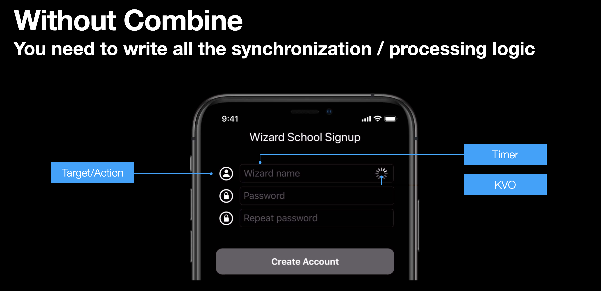
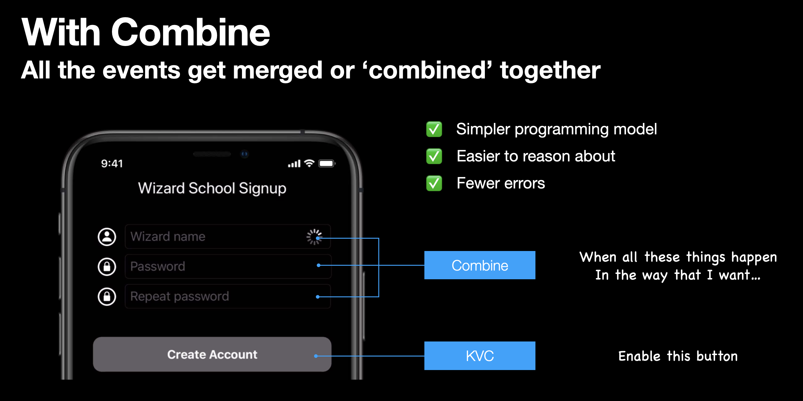
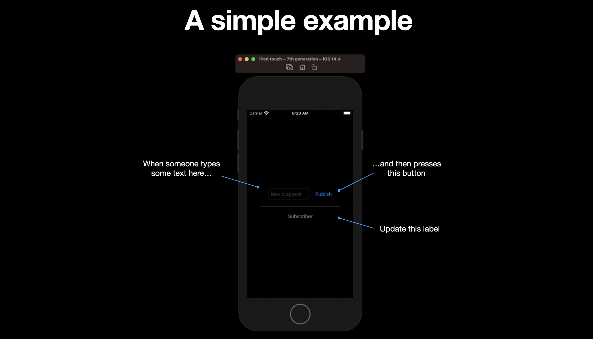
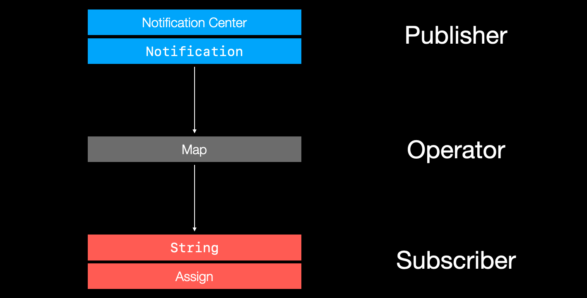

# Getting Started with Combine

## What is Combine?

[Combine](https://developer.apple.com/documentation/combine) is a unified Swift API framework for processing events over time. What kind of events? Mostly asynchronous one. Kind kind that fire continuously as our applications are running, making us want to update our UI.

- Target/Action
- Notification center
- URLSession
- Key-Value observing (KVO)
- Ad-hoc callbacks

What Combine does is it takes all these events, streams them into one chain of flow, and then enables you to operate on them. Adding logic, determining outcomes, and then ultimately decide where and how to update your UI.

## Where would I use it?

Let's say we are building wizard registration app. And before a wizard can create an account we need to check that:

- the wizard's name is unique (asynchronous call to backend server)
- they have entered a valid password, and
- they have correctly entered the repeat password twice

There is a lot of asynchronous eventing going on here. First we need to listen for when the user taps the text field via a target-action. Then we don't want to call the backend on every keypress as a wizard types in their username - set we setup a timer to debounce and only send the request every couple seconds. Then we might use KVO (Key Value Observing) to notify ourselves that the value of the wizard field has changed, and run additional processing logic to see if the other conditions have been met.



What Combine does, it is takes all these different events, logic, and timing, and combines them into one stream, that we can query, and ask: "Have all these conditions been met."



- It can listen for the result of an asynchronous call to `URLSession`.
- It can merge the validation results from the username, password, and repeat password fields
- And then it can use that result to update the state of the create account button via KVC (Key Value Coding).

But before we get into a full on example like this, let's start with an even simpler example to see the mechanics behind how it works.

## How it works

In this simple example we will use Combine to:

- update a label
- when a button is pressed
- with the contents of the text field




Combine is built around three main abstractions:

- Publishers
- Operators, and
- Subscribers

### Publishers

Publishers publish, or fire the events we are interested in receiving. Say for example that we want to be notified everytime a new blog post is ready to be published. We could a create a `NotificationCenter` based publisher and then fire it when the publish button is pressed.

```swift
extension Notification.Name {
    static let newBlogPost = Notification.Name("newPost")
}

struct BlogPost {
    let title: String
}

// Create a publisher
let publisher = NotificationCenter.Publisher(center: .default, name: .newBlogPost, object: nil)
 .map { (notification) -> String? in
     return (notification.object as? BlogPost)?.title ?? ""
}
```

### Operators

Operators take the output of publishers, and transform them into other data types downstream subscribers can understand. Like strings.

In this case for example, our `NotificationCenter` emits `Notification` as it's output. We need to convert that into a string based off the title of the blog post.



Operators do that though operations like `map`, which we can conveniently tack onto publishers with a closure.

```swift
.map { (notification) -> String? in
     return (notification.object as? BlogPost)?.title ?? ""
}
```

### Subscribers

Once we have our publishers and operators mapped, we are ready to subscribe. Subscription is a two step process. First we need to create the subscriber. Then we need to subscribe that subscriber to the publisher.

```swift
// Create a subscriber
let subscriber = Subscribers.Assign(object: subscribedLabel, keyPath: \.text)
publisher.subscribe(subscriber)
```

### Fire the event

We can fire the notification when the user taps the publish button. We grab the text from the text field, create a `BlogPost` using that text, and then fire it through the `NotificationCenter` which will in turn update the label.

```swift
@objc func publishButtonTapped(_ sender: UIButton) {
    // Post the notification
    let title = blogTextField.text ?? "Coming soon"
    let blogPost = BlogPost(title: title)
    NotificationCenter.default.post(name: .newBlogPost, object: blogPost)
}
```


### Source

**ViewController.swift**

```swift
import UIKit
import Combine

extension Notification.Name {
    static let newBlogPost = Notification.Name("newPost")
}

struct BlogPost {
    let title: String
}

class ViewController: UIViewController {

    @IBOutlet var blogTextField: UITextField!
    @IBOutlet var publishButton: UIButton!
    @IBOutlet var subscribedLabel: UILabel!
    
    override func viewDidLoad(  ) {
        super.viewDidLoad()

        publishButton.addTarget(self, action: #selector(publishButtonTapped), for: .primaryActionTriggered)
        
        // Create a publisher
        let publisher = NotificationCenter.Publisher(center: .default, name: .newBlogPost, object: nil)
         .map { (notification) -> String? in
             return (notification.object as? BlogPost)?.title ?? ""
         }
        
        // Create a subscriber
        let subscriber = Subscribers.Assign(object: subscribedLabel, keyPath: \.text)
        publisher.subscribe(subscriber)
    }
    
    @objc func publishButtonTapped(_ sender: UIButton) {
        // Post the notification
        let title = blogTextField.text ?? "Coming soon"
        let blogPost = BlogPost(title: title)
        NotificationCenter.default.post(name: .newBlogPost, object: blogPost)
    }
}
```

### Summary

So that's as simple as Combine gets. The important things to understand at this point are that:

- Combine is a framework for processing events.
- It leverages existing technologies like NotificationCenter, KVO and KVC to publish and send events.

And its got three main abstractions:

- Publishers - publish events.
- Operators - map and transform the results from publishers.
- Subscribers - consume the events publishers send out.

# A more complicated example
	
### Links that help

- [Introducing Combine - WWDC 2019](https://developer.apple.com/videos/play/wwdc2019/722)
- [Combine in Practice - WWDC 2019](https://developer.apple.com/videos/play/wwdc2019/721/)
- [Use Your Loaf - Getting started with Combine](https://useyourloaf.com/blog/getting-started-with-combine/)
- [AvanderLee - Getting started with Combine](https://www.avanderlee.com/swift/combine/)


