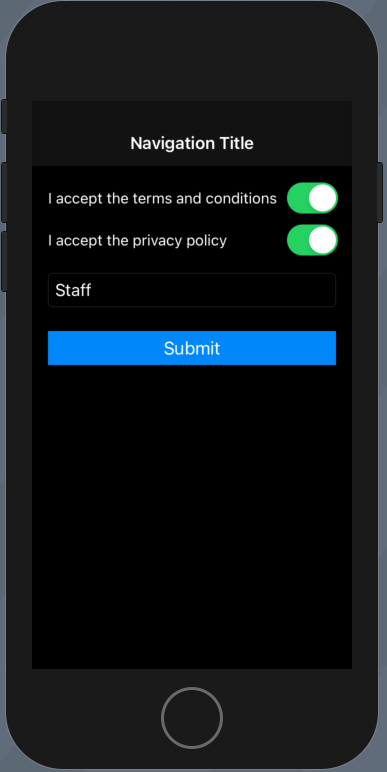

# Terms & Conditions Demo



```swift
import UIKit
import SwiftUI
import Combine

final class ViewController: UIViewController {

    let termsLabel = UILabel()
    let termsSwitch = UISwitch()

    let privacyLabel = UILabel()
    let privacySwitch = UISwitch()
    
    let nameField = UITextField()
    let submitButton = UIButton()
    
    // Define publishers
    @Published private var acceptedTerms = false
    @Published private var acceptedPrivacy = false
    @Published private var name = ""
    
    // Define operators on publishers
    private var validToSubmit: AnyPublisher<Bool, Never> {
      return Publishers.CombineLatest3($acceptedTerms, $acceptedPrivacy, $name)
        .map { terms, privacy, name in
          terms && privacy && !name.isEmpty
        }.eraseToAnyPublisher()
    }
    
    // Define subscriptions
    var stream: AnyCancellable?
    
    override func viewDidLoad() {
        super.viewDidLoad()
        
        // Connect subsciber to publisher and assign to control via Keypath
        stream = validToSubmit
          .receive(on: RunLoop.main)
          .assign(to: \.isEnabled, on: submitButton)
        
        setup()
        style()
        layout()
    }
}

// MARK: - Actions
extension ViewController {
    @objc func acceptedTerms(_ sender: UISwitch) {
        acceptedTerms = sender.isOn
    }
    
    @objc func acceptedPrivacy(_ sender: UISwitch) {
        acceptedPrivacy = sender.isOn
    }
    
    @objc func nameChanged(_ sender: UITextField) {
        name = sender.text ?? ""
    }
    
    @objc func submitPressed(_ sender: UIButton) {
        print("submitPressed!")
    }
}


extension ViewController {
    func setup() {
        title = "Terms of Use"
    }
    
    func style() {
        termsLabel.translatesAutoresizingMaskIntoConstraints = false
        termsLabel.text = "I accept the terms and conditions"
        termsLabel.font = UIFont.preferredFont(forTextStyle: .subheadline)
        
        termsSwitch.translatesAutoresizingMaskIntoConstraints = false
        termsSwitch.addTarget(self, action: #selector(acceptedTerms(_:)), for: .primaryActionTriggered)
        
        privacyLabel.translatesAutoresizingMaskIntoConstraints = false
        privacyLabel.text = "I accept the privacy policy"
        privacyLabel.font = UIFont.preferredFont(forTextStyle: .subheadline)
        
        privacySwitch.translatesAutoresizingMaskIntoConstraints = false
        privacySwitch.addTarget(self, action: #selector(acceptedPrivacy(_:)), for: .primaryActionTriggered)
        
        nameField.translatesAutoresizingMaskIntoConstraints = false
        nameField.placeholder = "Name"
        nameField.borderStyle = .roundedRect
        nameField.addTarget(self, action: #selector(nameChanged(_:)), for: .editingChanged)
        
        submitButton.translatesAutoresizingMaskIntoConstraints = false
        submitButton.setTitle("Submit", for: .normal)
        submitButton.backgroundColor = .systemBlue
        submitButton.addTarget(self, action: #selector(submitPressed(_:)), for: .primaryActionTriggered)
    }
    
    func layout() {
        view.addSubview(termsLabel)
        view.addSubview(termsSwitch)
        view.addSubview(privacyLabel)
        view.addSubview(privacySwitch)
        view.addSubview(nameField)
        view.addSubview(submitButton)

        NSLayoutConstraint.activate([
            // Terms
            termsLabel.topAnchor.constraint(equalToSystemSpacingBelow: view.safeAreaLayoutGuide.topAnchor, multiplier: 3),
            termsLabel.leadingAnchor.constraint(equalToSystemSpacingAfter: view.safeAreaLayoutGuide.leadingAnchor, multiplier: 2),
            termsSwitch.centerYAnchor.constraint(equalTo: termsLabel.centerYAnchor),
            view.trailingAnchor.constraint(equalToSystemSpacingAfter: termsSwitch.trailingAnchor, multiplier: 2),
            
            // Privacy
            termsSwitch.leadingAnchor.constraint(equalToSystemSpacingAfter: termsLabel.trailingAnchor, multiplier: 1),
            privacyLabel.topAnchor.constraint(equalToSystemSpacingBelow: termsLabel.bottomAnchor, multiplier: 3),
            privacyLabel.leadingAnchor.constraint(equalTo: termsLabel.leadingAnchor),
            privacySwitch.centerYAnchor.constraint(equalTo: privacyLabel.centerYAnchor),
            privacySwitch.trailingAnchor.constraint(equalTo: termsSwitch.trailingAnchor),
            
            // Name
            nameField.topAnchor.constraint(equalToSystemSpacingBelow: privacyLabel.bottomAnchor, multiplier: 3),
            nameField.leadingAnchor.constraint(equalTo: termsLabel.leadingAnchor),
            nameField.trailingAnchor.constraint(equalTo: termsSwitch.trailingAnchor),
            
            // Button
            submitButton.topAnchor.constraint(equalToSystemSpacingBelow: nameField.bottomAnchor, multiplier: 3),
            submitButton.leadingAnchor.constraint(equalTo: termsLabel.leadingAnchor),
            submitButton.trailingAnchor.constraint(equalTo: termsSwitch.trailingAnchor),
        ])
    }
}

#if canImport(SwiftUI) && DEBUG
import SwiftUI

extension ViewController: UIViewControllerRepresentable {
    func makeUIViewController(context: Context) -> ViewController {
        return ViewController()
    }
    
    func updateUIViewController(_ uiViewController: ViewController, context: Context) {}
}

@available(iOS 13.0, *)
struct ViewControllerPreviews: PreviewProvider {
  static var previews: some View {
    NavigationView {
        ViewController()
            .navigationBarTitle(Text("Navigation Title"), displayMode: .inline)
            .preferredColorScheme(.dark)
    }
  }
}
#endif
```

### Links that help

- [Use Your Loaf - Getting started with Combine](https://useyourloaf.com/blog/getting-started-with-combine/)


