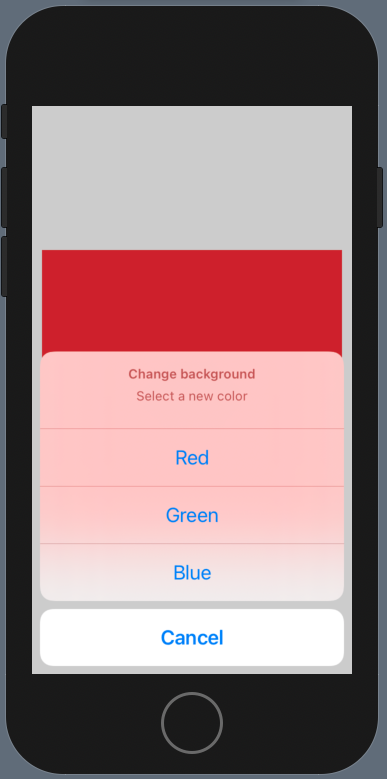

# ActionSheet

An alternative to `Alert` that lets us add many buttons. ActionSheet slides up from the bottom.

```swift
struct ContentView: View {
    @State private var showingActionSheet = false
    @State private var backgroundColor = Color.white

    var body: some View {
        Text("Hello, World!")
            .frame(width: 300, height: 300)
            .background(backgroundColor)
            .onTapGesture {
                self.showingActionSheet = true
            }
            .actionSheet(isPresented: $showingActionSheet) {
                ActionSheet(title: Text("Change background"), message: Text("Select a new color"), buttons: [
                    .default(Text("Red")) { self.backgroundColor = .red },
                    .default(Text("Green")) { self.backgroundColor = .green },
                    .default(Text("Blue")) { self.backgroundColor = .blue },
                    .cancel()
                ])
            }
    }
}
```




### Links that help

- [Showing multiple options with ActionSheet](https://www.hackingwithswift.com/books/ios-swiftui/showing-multiple-options-with-actionsheet)