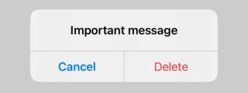

# Alert

*When* should an alert be shown and *how*? Views are a function of our program state, and alerts aren’t an exception to that. So, rather than saying “show the alert”, we instead create our alert and set the conditions under which it should be shown.

We don’t assign the alert to a variable then write something like `myAlert.show()`, because that would be back the old “series of events” way of thinking.

Instead, we create some state that tracks whether our alert is showing, like this.

```swift
import SwiftUI

struct ContentView: View {
    @State private var showingAlert = false
    
    var body: some View {
        Button("Show Alert") {
            showingAlert = true
        }
        .alert("Important message!", isPresented: $showingAlert) {
            Button("OK", role: .cancel) { }
        }
    }
}

struct ContentView_Previews: PreviewProvider {
    static var previews: some View {
        ContentView()
    }
}
```



Note: by default all buttons dismiss the alert, and the `$showingAlert` gets reset back to false upon dismiss as part of its two way binding.

Note also how cancel button is automatically added.

```swift
import SwiftUI

struct ContentView: View {
    @State private var showingAlert = false
    
    var body: some View {
        Button("Show Alert") {
            showingAlert = true
        }
        .alert("Important message!", isPresented: $showingAlert) {
            Button("First") { }
            Button("Second") { }
            Button("Third") { }
        }
    }
}

struct ContentView_Previews: PreviewProvider {
    static var previews: some View {
        ContentView()
    }
}
```


