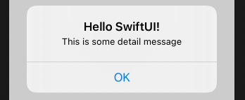

# Alert

```swift
struct ContentView: View {
    @State private var showingAlert = false

    var body: some View {
        Button("Show Alert") {
            showingAlert = true
        }
        .alert("Important message", isPresented: $showingAlert) {
            Button("OK", role: .cancel) { }
        }
    }
}
```



### Links that help

- [Hudson - how to show an alert](https://www.hackingwithswift.com/quick-start/swiftui/how-to-show-an-alert)