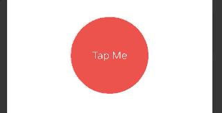
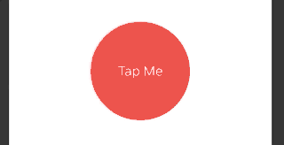
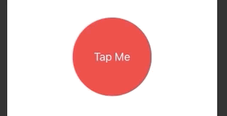
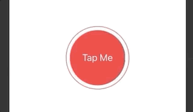

# Animations

## Implicit animations

Animation is a function of state.

```swift
struct ContentView: View {
    
    @State private var animationAmount: CGFloat = 1
    
    var body: some View {
        
        Button("Tap Me") {
            self.animationAmount += 1
        }
        .padding(50)
        .background(Color.red)
        .foregroundColor(.white)
        .clipShape(Circle())
        .scaleEffect(animationAmount)
        .blur(radius: (animationAmount - 1) * 3)
        .animation(.default)
    }
}
```


## Customizing

### easeOut

```swift
struct ContentView: View {
    
    @State private var animationAmount: CGFloat = 1
    
    var body: some View {
    
        Button("Tap Me") {
                self.animationAmount += 1
            }
            .padding(50)
            .background(Color.red)
            .foregroundColor(.white)
            .clipShape(Circle())
            .scaleEffect(animationAmount)
            .animation(.easeInOut)
        
    }
    
}
```



```swift
.animation(
    Animation.easeInOut(duration: 2)
        .delay(1)
)
```



```swift
.animation(
    Animation.easeInOut(duration: 1)
        .repeatCount(3, autoreverses: true)
)
```



```swift
struct ContentView: View {
    
    @State private var animationAmount: CGFloat = 1
    
    var body: some View {
        
        Button("Tap Me") {
            // self.animationAmount += 1
        }
        .padding(40)
        .background(Color.red)
        .foregroundColor(.white)
        .clipShape(Circle())
        .overlay(
            Circle()
                .stroke(Color.red)
                .scaleEffect(animationAmount)
                .opacity(Double(2 - animationAmount))
                .animation(
                    Animation.easeOut(duration: 1)
                        .repeatForever(autoreverses: false)
                )
        )
        .onAppear {
            self.animationAmount = 2
        }
    }
    
}
```




### Links that help

- [Implicit animations](https://www.hackingwithswift.com/books/ios-swiftui/creating-implicit-animations)
- [Customizing animations in SwiftUI](https://www.hackingwithswift.com/books/ios-swiftui/customizing-animations-in-swiftui)