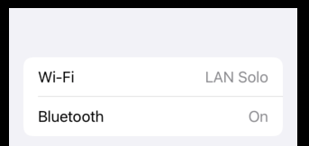

# Badges

```swift
import SwiftUI

struct ContentView: View {
    
    var body: some View {
        TabView {
            Text("Your home screen goes here")
                .tabItem {
                    Label("Home", systemImage: "house")
                }
                .badge(5)
        }
    }
}

struct ContentView_Previews: PreviewProvider {
    static var previews: some View {
        ContentView()
    }
}
```


Can also be used for lists like this.

```swift
import SwiftUI

struct ContentView: View {
    
    var body: some View {
        List {
            Text("Wi-Fi")
                .badge("LAN Solo")
            Text("Bluetooth")
                .badge("On")
        }
    }
}

struct ContentView_Previews: PreviewProvider {
    static var previews: some View {
        ContentView()
    }
}
```

