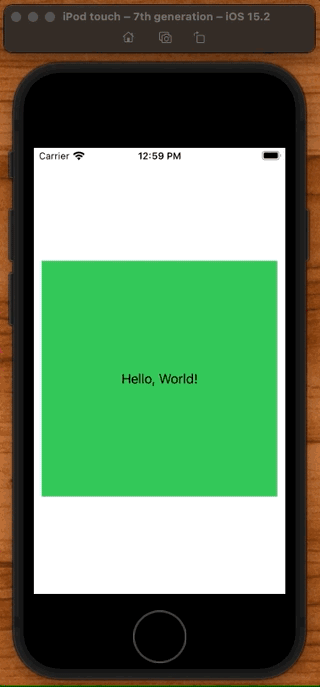

# ConfirmationDialog

Like an `alertSheet` from UIKit. Multibutton select at the bottom of the screen.



```swift
struct ContentView: View {
    @State private var showingConfirmation = false
    @State private var backgroundColor = Color.white

    var body: some View {
        Text("Hello, World!")
            .frame(width: 300, height: 300)
            .background(backgroundColor)
            .onTapGesture {
                showingConfirmation = true
            }
            .confirmationDialog("Change background", isPresented: $showingConfirmation) {
                Button("Red") { backgroundColor = .red }
                Button("Green") { backgroundColor = .green }
                Button("Blue") { backgroundColor = .blue }
                Button("Cancel", role: .cancel) { }
            } message: {
                Text("Select a new color")
            }
    }
}
```

### Links that help

- [Showing multiple options with confirmationDialog()](https://www.hackingwithswift.com/books/ios-swiftui/showing-multiple-options-with-confirmationdialog)
