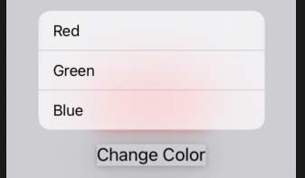

# ContextMenu

```swift
struct ContentView: View {
    @State private var backgroundColor = Color.red

    var body: some View {
        VStack {
            Text("Hello, World!")
                .padding()
                .background(backgroundColor)

            Text("Change Color")
                .padding()
                .contextMenu {
                    Button(action: {
                        self.backgroundColor = .red
                    }) {
                        Text("Red")
                    }

                    Button(action: {
                        self.backgroundColor = .green
                    }) {
                        Text("Green")
                    }

                    Button(action: {
                        self.backgroundColor = .blue
                    }) {
                        Text("Blue")
                    }
                }
        }
    }
}
```



### Links that help

- [ContextMenu](https://www.hackingwithswift.com/books/ios-swiftui/creating-context-menus)
