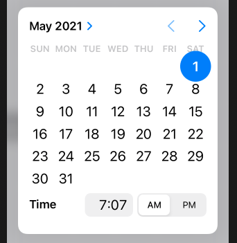

# DatePicker

```swift
struct ContentView: View {
    
    @State private var wakeUp = Date()
    
    var body: some View {
    
        DatePicker("Please enter a date", selection: $wakeUp)
    }
    
}
```


```swift
Form {
    DatePicker("Please enter a date", selection: $wakeUp)
}
```


```swift
DatePicker("Please enter a date", selection: $wakeUp)
        .labelsHidden()
```


### hourAndMinute

```swift
DatePicker("", selection: $wakeUp, displayedComponents: .hourAndMinute)
```


	
### date

```swift
DatePicker("", selection: $wakeUp, displayedComponents: .date)
```


### range

All the dates in the future, but none in the past.

```swift
DatePicker("Please enter a date", selection: $wakeUp, in: Date()...)
```




### Links that help

- [Selecting dates and times with DatePicker](https://www.hackingwithswift.com/books/ios-swiftui/selecting-dates-and-times-with-datepicker)
