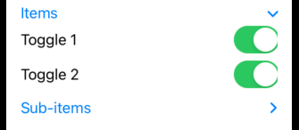

# DisclosureGroup

A view that shows or hides another content view, based on the state of a disclosure control.



```swift
import SwiftUI

struct ContentView: View {
    
    struct ToggleStates {
        var oneIsOn: Bool = false
        var twoIsOn: Bool = true
    }
    
    @State private var toggleStates = ToggleStates()
    @State private var topExpanded: Bool = true

    var body: some View {
        DisclosureGroup("Items", isExpanded: $topExpanded) {
            Toggle("Toggle 1", isOn: $toggleStates.oneIsOn)
            Toggle("Toggle 2", isOn: $toggleStates.twoIsOn)
            DisclosureGroup("Sub-items") {
                Text("Sub-item 1")
            }
        }
        .padding()
    }
}

struct ContentView_Previews: PreviewProvider {
    static var previews: some View {
        ContentView()
    }
}
```

### Links that help

- [Apple docs](https://developer.apple.com/documentation/swiftui/disclosuregroup)
