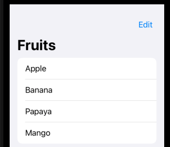
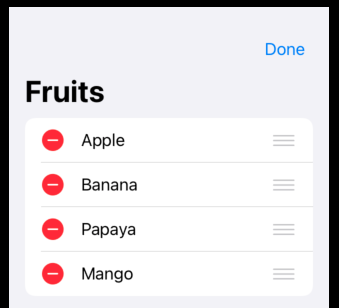

# EditButton

A button that toggles the edit mode for the current edit scope.





```swift
import SwiftUI

struct ContentView: View {
    @State private var fruits = [
        "Apple",
        "Banana",
        "Papaya",
        "Mango"
    ]
    
    var body: some View {
        NavigationView{
            List {
                ForEach(
                    fruits,
                    id: \.self
                ) { fruit in
                    Text(fruit)
                }
                .onDelete {_ in
                    // deleteFruit(at :$0)
                }
                .onMove {_,_ in
                    // moveFruit(from: $0, to: $1)
                }
            }
            .navigationTitle("Fruits")
            .toolbar { EditButton() }
        }
    }
}

struct ContentView_Previews: PreviewProvider {
    static var previews: some View {
        ContentView()
    }
}
```

### Links that help

- [Apple docs](https://developer.apple.com/documentation/swiftui/editbutton)
