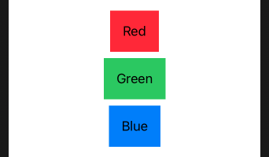

# ForEach

Used to create views while looping over a collection.

```swift
struct ContentView: View {
    var body: some View {
        VStack(alignment: .leading) {
            ForEach((1...10).reversed(), id: \.self) {
                Text("\($0)…")
            }

            Text("Ready or not, here I come!")
        }
    }
}
```


The .id(: \.self) part is required so that SwiftUI can identify each element in the array uniquely – it means that if you add or remove an item, SwiftUI knows exactly which one.

You can use this approach to create loops of any type. For example, this code creates an array of three colors, loops over them all, and creates text views using each color name and color value:

```swift
struct ContentView: View {
    let colors: [Color] = [.red, .green, .blue]

    var body: some View {
        VStack {
            ForEach(colors, id: \.self) { color in
                Text(color.description.capitalized)
                    .padding()
                    .background(color)
            }
        }
    }
}
```



Using `\.self` tells Swift each item is uniquely identified using its own value. So, if you have the array [1, 2, 3] and identify each value by `\.self` it means the first item has the identifier 1, the second 2, and the third 3.

If you have custom types in your array, you should use `id` with whatever property inside your type identifies it uniquely. For example, you could create a struct where the id property is a UUID, which mean it’s guaranteed to be unique – perfect for our purposes. We could create such a struct and then use it like this:

```swift
struct SimpleGameResult {
    let id = UUID()
    let score: Int
}

struct ContentView: View {
    let results = [
        SimpleGameResult(score: 8),
        SimpleGameResult(score: 5),
        SimpleGameResult(score: 10)
    ]

    var body: some View {
        VStack {
            ForEach(results, id: \.id) { result in
                Text("Result: \(result.score)")
            }
        }
    }
}
```


As an alternative, if you make a struct that conforms to the `Identifiable` protocol you can just write `ForEach(results)`. Conforming to this protocol means adding an id property that uniquely identifies each object, which in our case we already have. 

```swift
struct IdentifiableGameResult: Identifiable {
    var id = UUID()
    var score: Int
}

struct ContentView: View {
    let results = [
        IdentifiableGameResult(score: 8),
        IdentifiableGameResult(score: 5),
        IdentifiableGameResult(score: 10)
    ]

    var body: some View {
        VStack {
            ForEach(results) { result in
                Text("Result: \(result.score)")
            }
        }
    }
}
```

## Deleting items using onDelete()

The `onDelete()` modifier exists only on `ForEach`.

Here is a view that adds a new line with every button tap.

```swift
struct ContentView: View {
    @State private var numbers = [Int]()
    @State private var currentNumber = 1

    var body: some View {
        VStack {
            List {
                ForEach(numbers, id: \.self) {
                    Text("\($0)")
                }
            }

            Button("Add Number") {
                self.numbers.append(self.currentNumber)
                self.currentNumber += 1
            }
        }
    }
}
```

In order to make `onDelete()` work, we need to implement a method that will receive a single parameter of type `IndexSet`. This is a bit like a set of integers, except it’s sorted, and it’s just telling us the positions of all the items in the `ForEach` that should be removed.

Because our `ForEach` was created entirely from a single array, we can actually just pass that index set straight to our numbers array – it has a special `remove(atOffsets:)` method that accepts an index set.

```swift
func removeRows(at offsets: IndexSet) {
    numbers.remove(atOffsets: offsets)
}
```

Finally, we can tell SwiftUI to call that method when it wants to delete data from the `ForEach`, by modifying it to this:

```swift
ForEach(numbers, id: \.self) {
    Text("\($0)")
}
.onDelete(perform: removeRows)
```

Now go ahead and run your app, then add a few numbers. When you’re ready, swipe from right to left across any of the rows in your list, and you should find a delete button appears. You can tap that, or you can also use iOS’s swipe to delete functionality by swiping further.

Given how easy that was, I think the result works really well. But SwiftUI has another trick up its sleeve: we can add an Edit/Done button to the navigation bar, that lets users delete several rows more easily.

First, wrap your VStack in a NavigationView, then add this modifier to the VStack:

```swift
.navigationBarItems(leading: EditButton())
```

Full source:

```swift
struct ContentView: View {
    @State private var numbers = [Int]()
    @State private var currentNumber = 1

    var body: some View {
        VStack {
            List {
                ForEach(numbers, id: \.self) {
                    Text("\($0)")
                }.onDelete(perform: removeRows)
            }

            Button("Add Number") {
                self.numbers.append(self.currentNumber)
                self.currentNumber += 1
            }
        }.navigationBarItems(leading: EditButton())
    }
    
    func removeRows(at offsets: IndexSet) {
        numbers.remove(atOffsets: offsets)
    }
}

struct ContentView_Previews: PreviewProvider {
    static var previews: some View {
        ContentView()
    }
}
```


### Links that help

- [How to create views using ForEach](https://www.hackingwithswift.com/quick-start/swiftui/how-to-create-views-in-a-loop-using-foreach)
- [Deleting items using onDelete](https://www.hackingwithswift.com/books/ios-swiftui/deleting-items-using-ondelete)
