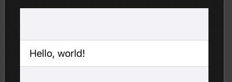
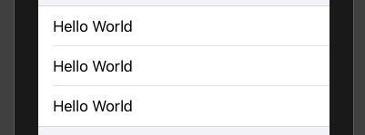
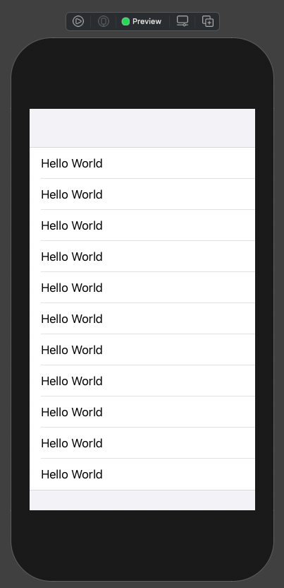
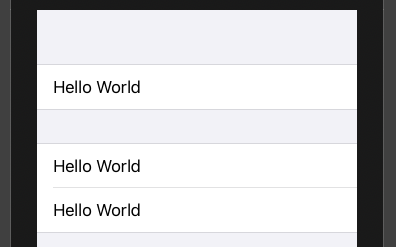
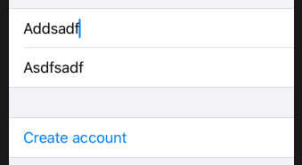

# Form

A container for grouping controls used for data entry, such as in settings or inspectors.

## Create

```swift
    var body: some View {
        Form {
            Text("Hello, world!")
        }
    }
```



Multiple lines.

```swift
    var body: some View {
        Form {
            Text("Hello World")
            Text("Hello World")
            Text("Hello World")
        }
    }
```



You can show up to ten rows in a form. After that you will have to group. This is by design - parents can only support ten children.

## Group

```swift
        Form {
            Group {
                Text("Hello World")
                Text("Hello World")
                Text("Hello World")
                Text("Hello World")
                Text("Hello World")
                Text("Hello World")
            }

            Group {
                Text("Hello World")
                Text("Hello World")
                Text("Hello World")
                Text("Hello World")
                Text("Hello World")
            }
        }
```



Groups don’t actually change the way your user interface looks, they just let us work around SwiftUI’s limitation of ten child views inside a parent – that’s text views inside a form, in this instance.

## Section

```swift
Form {
    Section {
        Text("Hello World")
    }

    Section {
        Text("Hello World")
        Text("Hello World")
    }
}
```



## Disable

Use `.disabled()` modifier.

```swift
struct ContentView: View {
    @State private var username = ""
    @State private var email = ""

    var body: some View {
        Form {
            Section {
                TextField("Username", text: $username)
                TextField("Email", text: $email)
            }

            Section {
                Button("Create account") {
                    print("Creating account…")
                }
            }
            .disabled(disableForm)
        }
    }
    
    var disableForm: Bool {
        username.count < 5 || email.count < 5
    }
}
```



- [Disabling forms](https://www.hackingwithswift.com/books/ios-swiftui/validating-and-disabling-forms)

### Links that help

- [Creating a form](https://www.hackingwithswift.com/books/ios-swiftui/creating-a-form)
