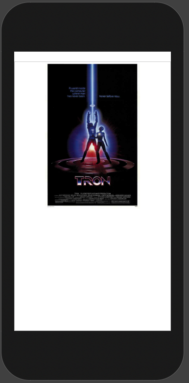
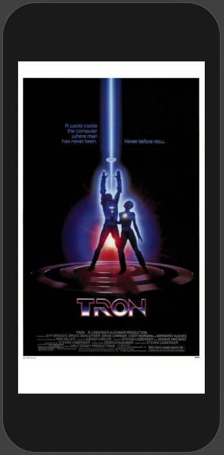

# GeometryReader

Gives you a `GeometryProxy` which lets us query our environment and set an image's size specifically.

```swift
VStack {
    GeometryReader { geo in
        Image("Example")
            .resizable()
            .aspectRatio(contentMode: .fit)
            .frame(width: geo.size.width, height: 300)
    }
}
```



Or to the full width of the screen depending on the device.

```swift
VStack {
    GeometryReader { geo in
        Image("Example")
            .resizable()
            .aspectRatio(contentMode: .fit)
            .frame(width: geo.size.width)
    }
}
```



### Links that help

- [Resizing images with GeometryReader](https://www.hackingwithswift.com/books/ios-swiftui/resizing-images-to-fit-the-screen-using-geometryreader)