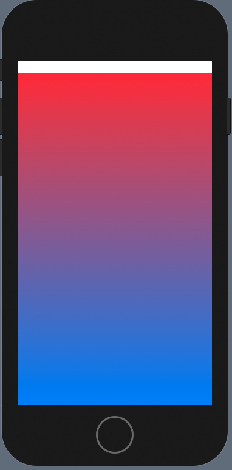
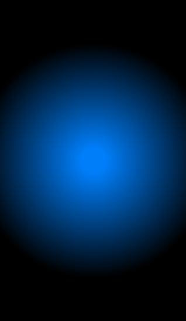
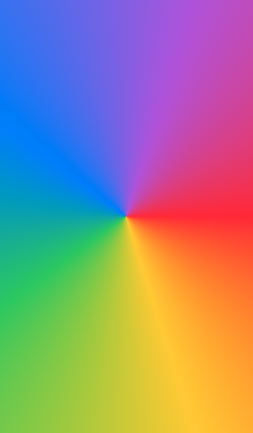

# Gradient

## Linear

```swift
LinearGradient(gradient: Gradient(colors: [.red, .blue]), startPoint: .top, endPoint: .bottom)    }
```



## Radial

```swift
RadialGradient(gradient: Gradient(colors: [.blue, .black]), center: .center, startRadius: 20, endRadius: 200)
```



## Angular

```swift
AngularGradient(gradient: Gradient(colors: [.red, .yellow, .green, .blue, .purple, .red]), center: .center)
```




### Links that help

- [Gradients](https://www.hackingwithswift.com/books/ios-swiftui/gradients)
