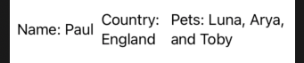

# Group

Commonly used to work around 10-child view limit. But also good as acting as a transparent layout container.

For example this group contains no layout information.

```swift
struct UserView: View {
    var body: some View {
        Group {
            Text("Name: Paul")
            Text("Country: England")
            Text("Pets: Luna, Arya, and Toby")
        }
    }
}
```

This makes it handy for grouping views, and then letting the parent decide the layout behavior.

```swift
struct ContentView: View {
    @State private var layoutVertically = false

    var body: some View {
        Group {
            if layoutVertically {
                VStack {
                    UserView()
                }
            } else {
                HStack {
                    UserView()
                }
            }
        }
        .onTapGesture {
            self.layoutVertically.toggle()
        }
    }
}
```




### Links that help

- [Using groups as transparent layout containers](https://www.hackingwithswift.com/books/ios-swiftui/using-groups-as-transparent-layout-containers)
