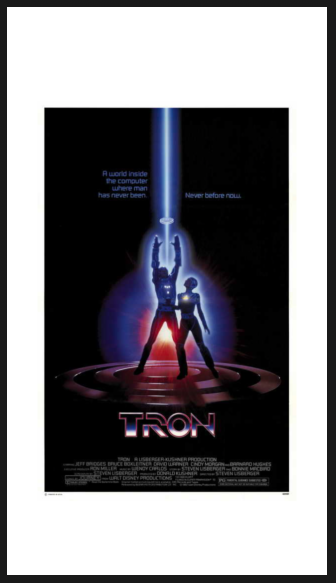
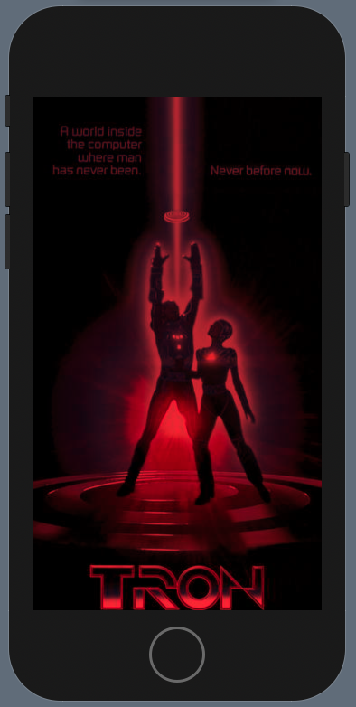

# Image

## Resizeable

```swift
Image("Tron")
    .resizable()
    .scaledToFit()
    .frame(width: 300, height: 300)
```



## Tint

```swift
var body: some View {
    Image("PaulHudson")
        .colorMultiply(.red)
}
```



### Links that help

- [Formatting our mission view](https://www.hackingwithswift.com/books/ios-swiftui/formatting-our-mission-view)
