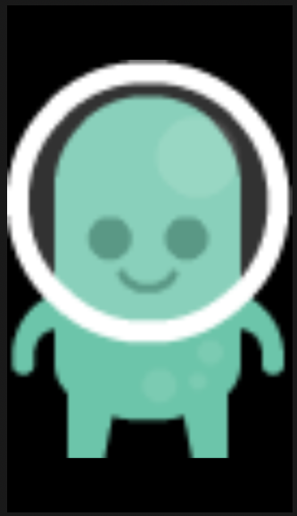

# Image

## Frame

```swift
struct CalendarView: View {
    var body: some View {
        Image(systemName: "calendar")
            .resizable()
            .frame(width: 50, height: 50)
            .padding()
            .background(Color.red)
            .cornerRadius(10)
            .foregroundColor(.white)
    }
}
```




## Resizeable

```swift
Image("Tron")
    .resizable()
    .scaledToFit()
    .frame(width: 300, height: 300)
```


## SF Symbols

```swift
Image(systemName: "chevron.left").imageScale(.small)
Image(systemName: "chevron.left").imageScale(.medium)
Image(systemName: "chevron.left").imageScale(.large)
```

## Tint

```swift
Image("Tron")
    .colorMultiply(.red)
```


### Links that help

- [Formatting our mission view](https://www.hackingwithswift.com/books/ios-swiftui/formatting-our-mission-view)
- [A guide to the SwiftUI layout system - Part 1](https://www.swiftbysundell.com/articles/swiftui-layout-system-guide-part-1/)
