# Lists

`List` is the equivalent of `UITableView`. Provides a scrollable table of data. Very similar to `Form`, except it's used for presentation of data rather than requesting user input.

```swift
List {
    Text("Hello World")
    Text("Hello World")
    Text("Hello World")
}
```

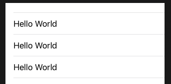

```swift
List {
    Section(header: Text("Section 1")) {
        Text("Static row 1")
        Text("Static row 2")
    }

    Section(header: Text("Section 2")) {
        ForEach(0..<5) {
            Text("Dynamic row \($0)")
        }
    }

    Section(header: Text("Section 3")) {
        Text("Static row 3")
        Text("Static row 4")
    }
}
```

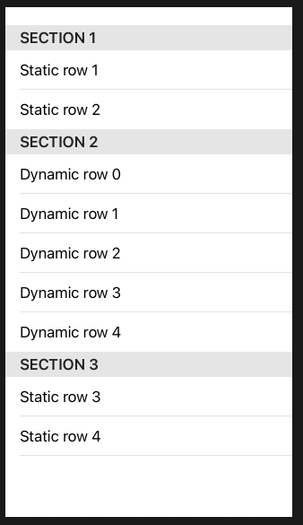

```swift
.listStyle(GroupedListStyle())
```

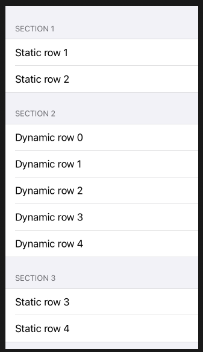

```swift
List(0..<5) {
    Text("Dynamic row \($0)")
}
```

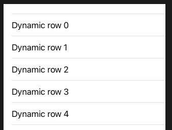

## id

When working with arrays of data SwiftUI needs to know how to identify each row uniquely, so if one gets removed it can simply remove that one rather than having to redraw the whole list. This is whwere the `id` parameter comes in, and it works identically in both `List` and `ForEach`.

When working with arrays of strings and numbers, the only thing that makes those values unique is the values themselves. That is, if we had the array [2, 4, 6, 8, 10], then those numbers themselves are themselves the unique identifiers. After all, we don’t have anything else to work with!

When working with this kind of list data, we use id: \.self like this:

```swift
struct ContentView: View {
    let people = ["Finn", "Leia", "Luke", "Rey"]

    var body: some View {
        List(people, id: \.self) {
            Text($0)
        }
    }
}
```

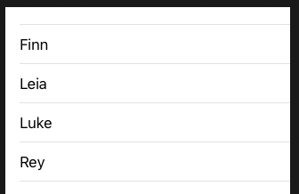

Works the same with `ForEach`.

```swift
List {
    ForEach(people, id: \.self) {
        Text($0)
    }
}
```

## List Styles

### automatic

```swift
struct ContentView: View {
    var body: some View {
        List(1..<20) {
            Text("\($0)")
        }.listStyle(.automatic)
    }
}
```

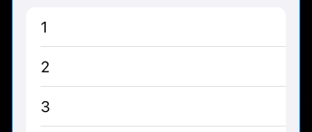

### grouped

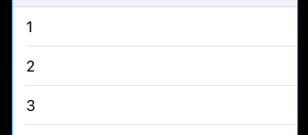

### inset

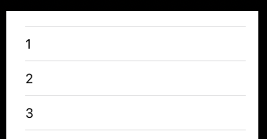

### insetGrouped

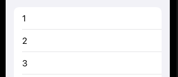

### plain

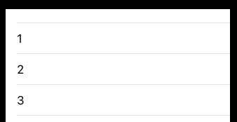

### sidebar

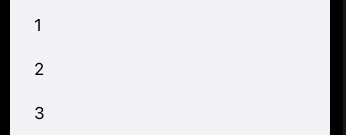


### Links that help

- [Introducing Lists](https://www.hackingwithswift.com/books/ios-swiftui/introducing-list-your-best-friend)
