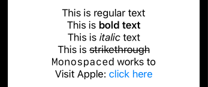

# Mark Down

```swift
import SwiftUI

struct ContentView: View {
    var body: some View {
        VStack {
            Text("This is regular text")
            Text("This is **bold text**")
            Text("This is *italic* text")
            Text("This is ~~strikethrough~~")
            Text("`Monospaced` works to")
            Text("Visit Apple: [click here](https://apple.com)")
        }
    }
}

struct ContentView_Previews: PreviewProvider {
    static var previews: some View {
        ContentView()
    }
}
```

- images don't yet work

