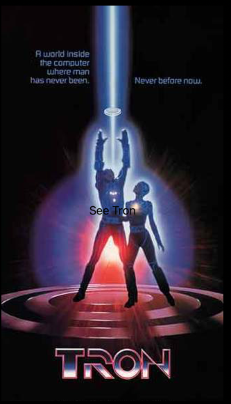
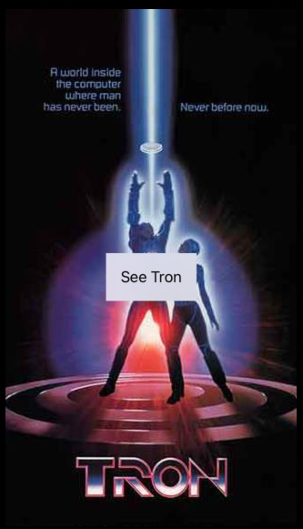

# Materials

Background and overlay using `ZStack`. Without materials text on image can be hard to see.

```swift
import SwiftUI

struct ContentView: View {
    
    var body: some View {
        ZStack {
            Image("tron")
            Text("See Tron")
                .padding()
        }
    }
}

struct ContentView_Previews: PreviewProvider {
    static var previews: some View {
        ContentView()
    }
}
```



But by adding materials background you can make it easy to see.

```swift
import SwiftUI

struct ContentView: View {
    
    var body: some View {
        ZStack {
            Image("tron")
            Text("See Tron")
                .padding()
                .background(.regularMaterial)
        }
    }
}

struct ContentView_Previews: PreviewProvider {
    static var previews: some View {
        ContentView()
    }
}
```



You can then specify the translucence using different enums.

```swift
.background(.regularMaterial)
.background(.thinMaterial)
.background(.thickMaterial)
.background(.ultraThinMaterial)
.background(.ultraThickMaterial)
```

Can also adjust the color of the text.

```swift
struct ContentView: View {
    
    var body: some View {
        ZStack {
            Image("tron")
            Text("See Tron")
                .padding()
                .background(.ultraThickMaterial)
                .foregroundColor(.secondary)
        }
    }
}

struct ContentView_Previews: PreviewProvider {
    static var previews: some View {
        ContentView()
    }
}
```

