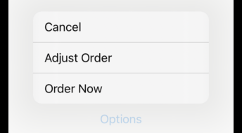
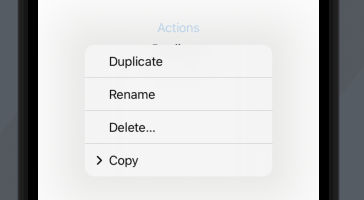
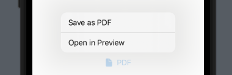

# Menu

Hold and press menu. If you long press you get the menu. If you quick tap you get the `justDoIt` action.

```swift
import SwiftUI

struct ContentView: View {
    
    var body: some View {
        Menu("Options") {
            Button("Order Now", action: placeOrder)
            Button("Adjust Order", action: adjustOrder)
            Button("Cancel", action: cancelOrder)
        } primaryAction: {
            justDoIt() // quick tap
        }
    }
    
    func justDoIt() {}
    func placeOrder() {}
    func adjustOrder() {}
    func cancelOrder() {}
}

struct ContentView_Previews: PreviewProvider {
    static var previews: some View {
        ContentView()
    }
}
```



## Embedded menu



```swift
import SwiftUI

struct MenuView: View {
    @State var text: String = "Hi"

    var body: some View {
        VStack {
            Menu("Actions") {
                Button("Duplicate", action: duplicate)
                Button("Rename", action: rename)
                Button("Delete…", action: delete)
                Menu("Copy") {
                    Button("Copy", action: copy)
                    Button("Copy Formatted", action: copyFormatted)
                    Button("Copy Library Path", action: copyPath)
                }
            }
            Text(text)
        }
    }

    func duplicate() { text = "Duplicate" }
    func rename() {  }
    func delete() {  }
    func copy() {  }
    func copyFormatted() {  }
    func copyPath() {  }
}

struct MenuView_Previews: PreviewProvider {
    static var previews: some View {
        MenuView()
    }
}
```

## With Label



```swift
import SwiftUI

struct MenuView: View {
    var body: some View {
        Menu {
            Button("Open in Preview", action: openInPreview)
            Button("Save as PDF", action: saveAsPDF)
        } label: {
            Label("PDF", systemImage: "doc.fill")
        }    }

    func openInPreview() {  }
    func saveAsPDF() {  }
}

struct MenuView_Previews: PreviewProvider {
    static var previews: some View {
        MenuView()
    }
}
```
