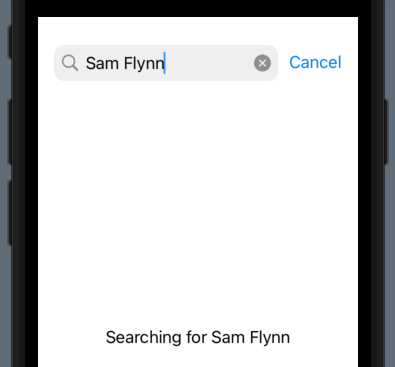
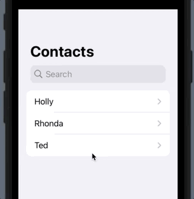
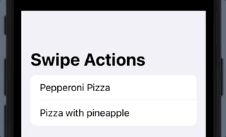
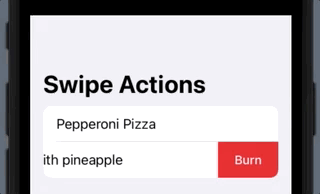
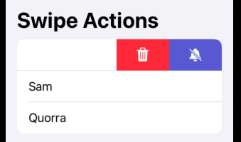

# Modifiers

## refreshable

```swift
import SwiftUI

struct NewsItem: Decodable, Identifiable {
    let id: Int
    let title: String
    let strap: String
}

struct ContentView: View {
    @State private var news = [
        NewsItem(id: 0, title: "Want the latest?", strap: "Pull to refresh!")
    ]
    
    var body: some View {
        NavigationView {
            List(news) { item in
                VStack(alignment: .leading) {
                    Text(item.title)
                        .font(.headline)
                    
                    Text(item.strap)
                        .foregroundColor(.secondary)
                }
                .id(item.id)
            }
            .refreshable {
                do {
                    let url = URL(string: "https:/www.hackingwithswift.com/samples/news-1.json")!
                    let (data, _) = try await URLSession.shared.data(from: url)
                    news = try JSONDecoder().decode([NewsItem].self, from: data)
                } catch {
                    news = []
                }
            }
        }
    }
}
```


## searchable

Place a search bar into a navigation view.

```swift
import SwiftUI

struct ContentView: View {
    @State private var searchText = ""
    
    var body: some View {
        NavigationView {
            Text("Searching for \(searchText)")
                .searchable(text: $searchText)
                .navigationTitle("Searchable example")
        }
    }
}

struct ContentView_Previews: PreviewProvider {
    static var previews: some View {
        ContentView()
    }
}
```



With filtering

```swift
import SwiftUI

struct ContentView: View {
    let names = ["Holly", "Rhonda", "Ted"]
    @State private var searchText = ""
    
    var body: some View {
        NavigationView {
            List {
                ForEach(searchResults, id: \.self) { name in
                    NavigationLink(destination: Text(name)) {
                        Text(name)
                    }
                }
            }
            .searchable(text: $searchText)
            .navigationTitle("Contacts")
        }
    }
    
    var searchResults: [String] {
        if searchText.isEmpty {
            return names
        } else {
            return names.filter { $0.contains(searchText) }
        }
    }
}

struct ContentView_Previews: PreviewProvider {
    static var previews: some View {
        ContentView()
    }
}
```



Autocomplete and suggestions

```swift
import SwiftUI

struct ContentView: View {
    let names = ["Holly", "Rhonda", "Ted"]
    @State private var searchText = ""
    
    var body: some View {
        NavigationView {
            List {
                ForEach(searchResults, id: \.self) { name in
                    NavigationLink(destination: Text(name)) {
                        Text(name)
                    }
                }
            }
            .searchable(text: $searchText) {
                ForEach(searchResults, id: \.self) { result in
                    Text("Are you looking for \(result)?")
                        .searchCompletion(result)
                }
            }
            .navigationTitle("Contacts")
        }
    }
    
    var searchResults: [String] {
        if searchText.isEmpty {
            return names
        } else {
            return names.filter { $0.contains(searchText) }
        }
    }
}

struct ContentView_Previews: PreviewProvider {
    static var previews: some View {
        ContentView()
    }
}
```


## swipe actions

```swift
import SwiftUI

struct ContentView: View {    
    var body: some View {
        NavigationView {
            List {
                Text("Pepperoni Pizza")
                    .swipeActions {
                        Button("Order") {
                            print("Awesome")
                        }
                        .tint(.green)
                    }
                Text("Pizza with pineapple")
                    .swipeActions {
                        Button("Order") {
                            print("Awesome")
                        }
                        .tint(.red)
                    }
            }
            .navigationTitle("Swipe Actions")
        }
    }
}

struct ContentView_Previews: PreviewProvider {
    static var previews: some View {
        ContentView()
    }
}
```



Built in roles

```swift
import SwiftUI

struct ContentView: View {
    var body: some View {
        NavigationView {
            List {
                Text("Pepperoni Pizza")
                    .swipeActions {
                        Button("Order", role: .cancel) {
                            print("Awesome")
                        }
                    }
                Text("Pizza with pineapple")
                    .swipeActions {
                        Button("Burn", role: .destructive) {
                            print("Awesome")
                        }
                    }
            }
            .navigationTitle("Swipe Actions")
        }
    }  
}

struct ContentView_Previews: PreviewProvider {
    static var previews: some View {
        ContentView()
    }
}
```



If you fully swipe, the swipe action will be activated. You can stop that and make the action explicit by disabling full swipe like this.

```swift
import SwiftUI

struct ContentView: View {
    let friends = ["Kevin", "Sam", "Quorra"]
    
    var body: some View {
        NavigationView {
            List {
                ForEach(friends, id: \.self) { friend in
                    Text(friend)
                        .swipeActions(allowsFullSwipe: false) {
                            Button {
                                print("Muting this conversation")
                            } label: {
                                Label("Mute", systemImage: "bell.slash.fill")
                            }
                            .tint(.indigo)
                            
                            Button(role: .destructive) {
                                print("Deleting this conversation")
                            } label: {
                                Label("Delete", systemImage: "trash.fill")
                            }
                        }
                }
            }
            .navigationTitle("Swipe Actions")
        }
    }
}

struct ContentView_Previews: PreviewProvider {
    static var previews: some View {
        ContentView()
    }
}
```



## confirmationDialog

This is the SwiftUI action sheet. Use this instead of `.alert`.

```swift
import SwiftUI

struct ContentView: View {
    @State private var showingOptions = false
    @State private var selected = "None"
    
    var body: some View {
        VStack {
            Text(selected)
            Button("Confirm paint color") {
                showingOptions = true
            }
            .confirmationDialog("Important message!", isPresented: $showingOptions, titleVisibility: .visible) {
                Button("Red", role: .destructive) {
                    selected = "Red"
                }
                Button("Green") {
                    selected = "Green"
                }
                Button("Blue") {
                    selected = "Blue"
                }
            }
        }
    }
}

struct ContentView_Previews: PreviewProvider {
    static var previews: some View {
        ContentView()
    }
}
```


## onSubmit

Can do on the `TextField` or you can take one level higher.

So instead of this:

```swift
import SwiftUI

struct ContentView: View {
    @State private var username = ""
    @State private var password = ""
    
    var body: some View {
        Form {
            TextField("Username", text: $username, onCommit: {
                
            })
            SecureField("Password", text: $password, onCommit: {
                
            })
        }
    }
}

struct ContentView_Previews: PreviewProvider {
    static var previews: some View {
        ContentView()
    }
}
```

You cna attach to the form:

```swift
import SwiftUI

struct ContentView: View {
    @State private var username = ""
    @State private var password = ""
    
    var body: some View {
        Form {
            TextField("Username", text: $username)
            SecureField("Password", text: $password)
        }
        .onSubmit {
            guard username.isEmpty == false && password.isEmpty == false else { return }
            print("Authenticating...")
        }
    }
}

struct ContentView_Previews: PreviewProvider {
    static var previews: some View {
        ContentView()
    }
}
```

## foregroundStyle

Make the whole view a certain foreground color.

```swift
import SwiftUI

struct ContentView: View {
    
    var body: some View {
        HStack {
            Image(systemName: "clock.fill")
            Text("Set the time")
        }
        .font(.largeTitle.bold())
        .foregroundStyle(.quaternary)
    }
}

struct ContentView_Previews: PreviewProvider {
    static var previews: some View {
        ContentView()
    }
}
```


## linearGradient

```swift
import SwiftUI

struct ContentView: View {
    
    var body: some View {
        HStack {
            Image(systemName: "clock.fill")
            Text("Set the time")
        }
        .font(.largeTitle.bold())
        .foregroundStyle(
            .linearGradient(colors: [.red, .blue], startPoint: .leading, endPoint: .trailing)
        )
    }
}

struct ContentView_Previews: PreviewProvider {
    static var previews: some View {
        ContentView()
    }
}
```

