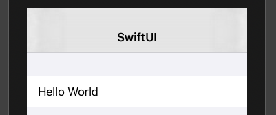

# Navigation Bar

```swift
var body: some View {
    NavigationView {
        Form {
            Section {
                Text("Hello World")
            }
        }
    }
}
```


```swift
.navigationBarTitle("SwiftUI", displayMode: .inline)
```




### Links that help

- [Navigation Bar](https://www.hackingwithswift.com/books/ios-swiftui/adding-a-navigation-bar)
