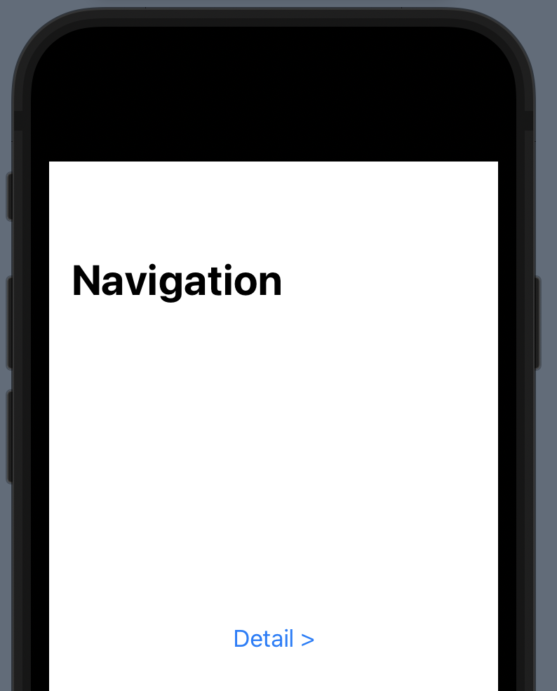
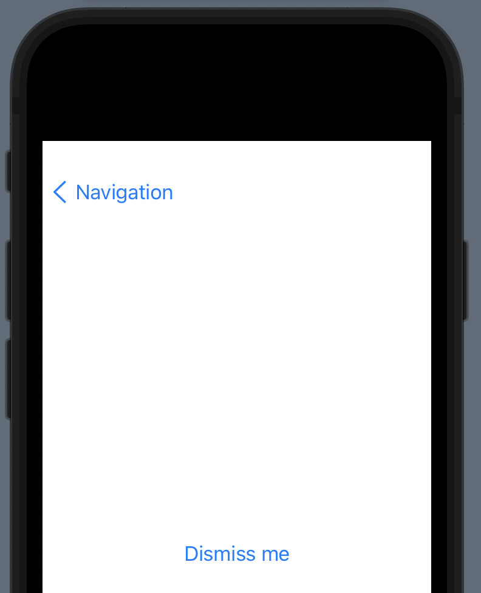

# NavigationLink

Our SwiftUI version of `UINavigationController`.

```swift
NavigationView {
    VStack {
        NavigationLink(destination: Text("Detail View")) {
            Text("Hello World")
        }
    }
    .navigationBarTitle("SwiftUI")
}
```

## How to programmatically dismiss





- Bind a `@State` property to the `isActive` attribute of `NavigationLink` 
- Toggle its state in the child detail causing the parent to re-render and stop showing the child view.

```swift
import SwiftUI

struct ContentView: View {
    @State private var isShowingDetailView = false

    var body: some View {
        NavigationView {
            VStack {
                NavigationLink(destination: DetailView(isShowingDetailView: $isShowingDetailView),
                               isActive: $isShowingDetailView) {
                    Text("Detail >")
                }.padding()
            }
            .navigationTitle("Navigation")
        }
    }
}

struct DetailView: View {
    @Binding var isShowingDetailView: Bool
    
    var body: some View {
        Button("Dismiss me") {
            isShowingDetailView.toggle()
        }
    }
}

struct ContentView_Previews: PreviewProvider {
    static var previews: some View {
        ContentView()
    }
}
```


### Links that help

- [Pushing views onto the stack using NavigationLink](https://www.hackingwithswift.com/books/ios-swiftui/pushing-new-views-onto-the-stack-using-navigationlink)