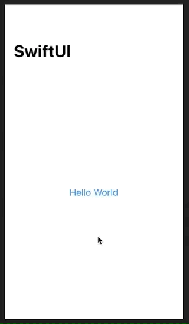

# NavigationLink

Our SwiftUI version of `UINavigationController`.

```swift
NavigationView {
    VStack {
        NavigationLink(destination: Text("Detail View")) {
            Text("Hello World")
        }
    }
    .navigationBarTitle("SwiftUI")
}
```



### Links that help

- [Pushing views onto the stack using NavigationLink](https://www.hackingwithswift.com/books/ios-swiftui/pushing-new-views-onto-the-stack-using-navigationlink)