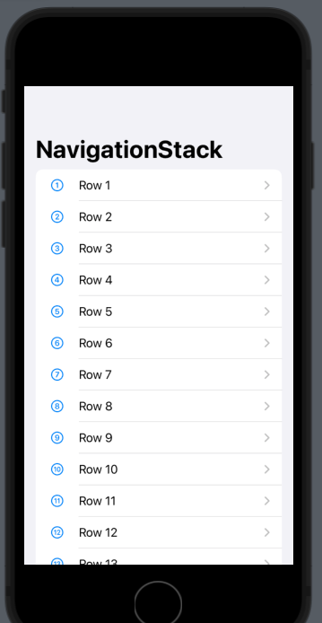
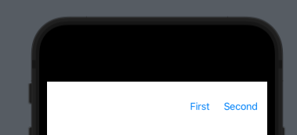

# NavigationStack




```swift
struct ContentView: View {
    var body: some View {
        NavigationStack {
            List(1..<20) { i in
                NavigationLink {
                    Text("Detail \(i)")
                } label: {
                    Label("Row \(i)", systemImage: "\(i).circle")
                }
            }
            .navigationTitle("NavigationStack")
        }
    }
}
```

You can attach a `value` to a `NavigationLink` like this:

```swift
struct ContentView: View {
    var body: some View {
        NavigationStack {
            List(1..<20) { i in
                NavigationLink(value: i) {
                    Label("Row \(i)", systemImage: "\(i).circle")
                }
            }
            .navigationDestination(for: Int.self) { i in
                Text("Detail \(i)")
            }
            .navigationTitle("NavigationStack")
        }
    }
}
```

- This method gives you state restoration out of the box
- Can do more advanced navigation like pop to root view controller

## Preselect rows from layout

```swift
struct ContentView: View {
    @State private var presentedNumbers = [1, 4, 8]

    var body: some View {
        NavigationStack(path: $presentedNumbers) {
            List(1..<20) { i in
                NavigationLink(value: i) {
                    Label("Row \(i)", systemImage: "\(i).circle")
                }
            }
            .navigationDestination(for: Int.self) { i in
                Text("Detail \(i)")
            }
            .navigationTitle("NavigationStack")
        }
    }
}
```

Path is an array of links that you can walk back:


## Navigation Path

You can push different values based on the type passed in - i.e. `String` or `Int`:

```swift
struct ContentView: View {
    @State private var presentedNumbers = NavigationPath()

    var body: some View {
        NavigationStack(path: $presentedNumbers) {

            NavigationLink(value: "Example String") {
                Text("Tap me")
            }

            List(1..<20) { i in
                NavigationLink(value: i) {
                    Label("Row \(i)", systemImage: "\(i).circle")
                }
            }
            .navigationDestination(for: String.self) { s in
                Text("String: \(s)")
            }
            .navigationDestination(for: Int.self) { i in
                Text("Detail \(i)")
            }
            .navigationTitle("NavigationStack")
        }
    }
}
```


## Toolbar / NavBar Items



Place buttons in the nav ba using `ToolBar`:

```swift
import SwiftUI

struct PlaceDetail: View {
    let place: Place
    var body: some View {
        Text("Hello, World!").padding()
            .toolbar {
                ToolbarItemGroup(placement: .navigationBarTrailing) {
                    Button("First") {
                        print("Pressed")
                    }

                    Button("Second") {
                        print("Pressed")
                    }
                }
            }
    }
}

struct PlaceDetail_Previews: PreviewProvider {
    static var previews: some View {
        NavigationStack {
            PlaceDetail(place: place)
        }
    }
}
```

### Links that help

- [Paul Hudson](https://www.youtube.com/watch?v=4obxmYn2AoI&ab_channel=PaulHudson)