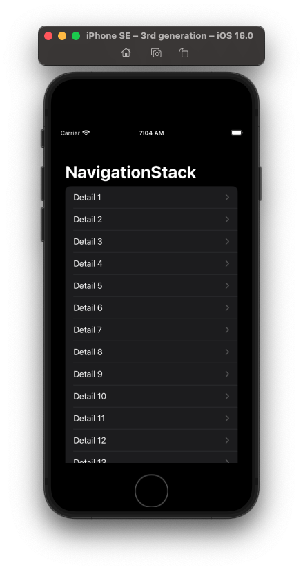
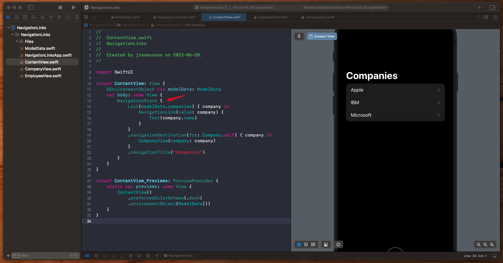
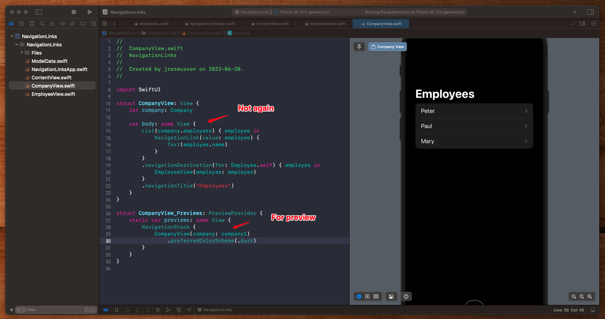
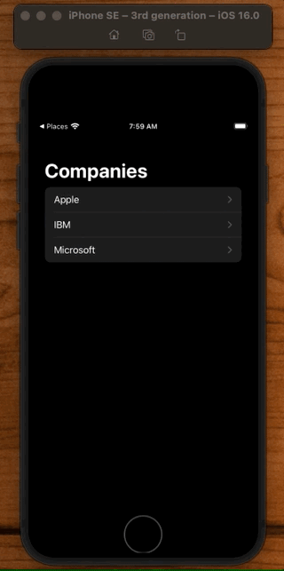
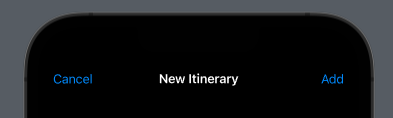

# NavigationStack

## Simple



```swift
import SwiftUI

struct ContentView: View {
    var body: some View {
        NavigationStack {
            List(1..<20) { i in
                NavigationLink("Detail \(i)") {
                    Text("Detail \(i)")
                }
            }
            .navigationTitle("NavigationStack")
        }
    }
}

struct ContentView_Previews: PreviewProvider {
    static var previews: some View {
        ContentView()
    }
}
```

## Value

```swift
import SwiftUI

struct ContentView: View {
    @EnvironmentObject var modelData: ModelData
    var body: some View {
        NavigationStack {
            List(modelData.companies) { company in
                NavigationLink(value: company) {
                    Text(company.name)
                }
            }
            .navigationDestination(for: Company.self) { company in
                CompanyView(company: company)
            }
            .navigationTitle("Companies")
        }
    }
}

struct ContentView_Previews: PreviewProvider {
    static var previews: some View {
        ContentView()
            .preferredColorScheme(.dark)
            .environmentObject(ModelData())
    }
}
```

## How to Style Navigation Link

Style your row without the chevron:


**FriendRow**

```swift
struct FriendRow: View {
    var body: some View {
        HStack {
            Image(systemName: "person")
            Text("Kate Grella")
            Spacer()
        }
    }
}
```

Then add the chevron via a `NavigationLink` using your row view in the `Label`:


**FriendDetails**

```swift
struct FriendDetails: View {
    var body: some View {
        List {
            Section(header: Text("Friends")) {
                NavigationLink {
                    Text("Detail")
                } label: {
                    FriendRow()
                }
            }
            .headerProminence(.increased)
        }
    }
}
```


## List within a List

You define your stack once at the top:



But you don't define it again on subviews:



You can embed the subview in a `NavigationStack` for preview purposes. But because it was already embedded in the parent, there is no need to do so again in the view.


**ModelData**

```swift
import Foundation

struct Employee: Hashable, Identifiable {
    let id = UUID()
    let name: String
}

struct Company: Hashable, Identifiable {
    let id = UUID()
    let name: String
    let employees: [Employee]
}

let employee1 = Employee(name: "Peter")
let employee2 = Employee(name: "Paul")
let employee3 = Employee(name: "Mary")
let employees = [employee1, employee2, employee3]

let company1 = Company(name: "Apple", employees: employees)
let company2 = Company(name: "IBM", employees: employees)
let company3 = Company(name: "Microsoft", employees: employees)

final class ModelData: ObservableObject {
    var companies = [company1, company2, company3]
}
```

**App**

```swift
import SwiftUI

@main
struct NavigationLinksApp: App {
    @StateObject private var modelData = ModelData()

    var body: some Scene {
        WindowGroup {
            ContentView()
                .environmentObject(modelData)
        }
    }
}
```

**ContentView**

```swift
import SwiftUI

struct ContentView: View {
    @EnvironmentObject var modelData: ModelData
    var body: some View {
        NavigationStack {
            List(modelData.companies) { company in
                NavigationLink(value: company) {
                    Text(company.name)
                }
            }
            .navigationDestination(for: Company.self) { company in
                CompanyView(company: company)
            }
            .navigationTitle("Companies")
        }
    }
}

struct ContentView_Previews: PreviewProvider {
    static var previews: some View {
        ContentView()
            .preferredColorScheme(.dark)
            .environmentObject(ModelData())
    }
}
```

**CompanyView**

```swift
import SwiftUI

struct CompanyView: View {
    let company: Company

    var body: some View {
        List(company.employees) { employee in
            NavigationLink(value: employee) {
                Text(employee.name)
            }
        }
        .navigationDestination(for: Employee.self) { employee in
            EmployeeView(employee: employee)
        }
        .navigationTitle("Employees")
    }
}

struct CompanyView_Previews: PreviewProvider {
    static var previews: some View {
        NavigationStack {
            CompanyView(company: company1)
                .preferredColorScheme(.dark)
        }
    }
}
```

**EmployeeView**

```swift
import SwiftUI

struct EmployeeView: View {
    let employee: Employee

    var body: some View {
        Text("Hello \(employee.name)")
    }
}

struct EmployeeView_Previews: PreviewProvider {
    static var previews: some View {
        EmployeeView(employee: employee1)
            .preferredColorScheme(.dark)
    }
}
```



## Examples


```swift
struct ContentView: View {
    var body: some View {
        NavigationStack {
            List(1..<20) { i in
                NavigationLink {
                    Text("Detail \(i)")
                } label: {
                    Label("Row \(i)", systemImage: "\(i).circle")
                }
            }
            .navigationTitle("NavigationStack")
        }
    }
}
```

You can attach a `value` to a `NavigationLink` like this:

```swift
struct ContentView: View {
    var body: some View {
        NavigationStack {
            List(1..<20) { i in
                NavigationLink(value: i) {
                    Label("Row \(i)", systemImage: "\(i).circle")
                }
            }
            .navigationDestination(for: Int.self) { i in
                Text("Detail \(i)")
            }
            .navigationTitle("NavigationStack")
        }
    }
}
```

- This method gives you state restoration out of the box
- Can do more advanced navigation like pop to root view controller

## Preselect rows from layout

```swift
struct ContentView: View {
    @State private var presentedNumbers = [1, 4, 8]

    var body: some View {
        NavigationStack(path: $presentedNumbers) {
            List(1..<20) { i in
                NavigationLink(value: i) {
                    Label("Row \(i)", systemImage: "\(i).circle")
                }
            }
            .navigationDestination(for: Int.self) { i in
                Text("Detail \(i)")
            }
            .navigationTitle("NavigationStack")
        }
    }
}
```

Path is an array of links that you can walk back:


## Navigation Path

You can push different values based on the type passed in - i.e. `String` or `Int`:

```swift
struct ContentView: View {
    @State private var presentedNumbers = NavigationPath()

    var body: some View {
        NavigationStack(path: $presentedNumbers) {

            NavigationLink(value: "Example String") {
                Text("Tap me")
            }

            List(1..<20) { i in
                NavigationLink(value: i) {
                    Label("Row \(i)", systemImage: "\(i).circle")
                }
            }
            .navigationDestination(for: String.self) { s in
                Text("String: \(s)")
            }
            .navigationDestination(for: Int.self) { i in
                Text("Detail \(i)")
            }
            .navigationTitle("NavigationStack")
        }
    }
}
```


## Titles

### Inline



```swift
.navigationBarTitleDisplayMode(.inline)
```


### Links that help

- [Paul Hudson](https://www.youtube.com/watch?v=4obxmYn2AoI&ab_channel=PaulHudson)