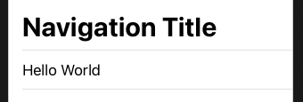
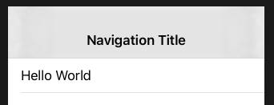
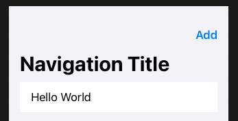
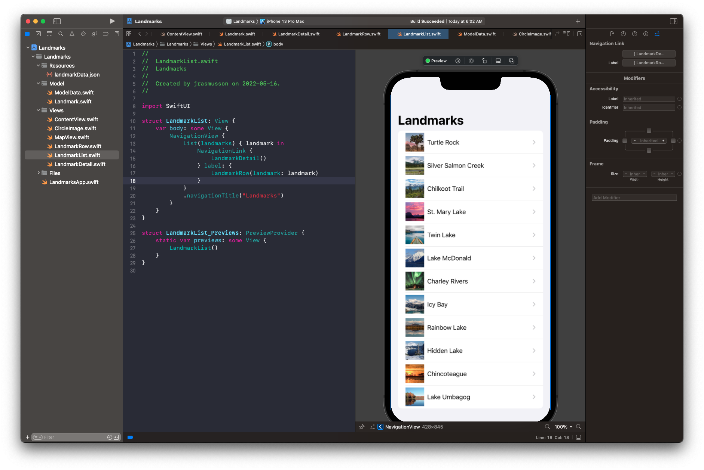

# Navigation Bar

```swift
NavigationView {
            List {
                Text("Hello World")
            }
            .navigationBarTitle(Text("Navigation Title")) // Default to large title style
        }
```



Old style.

```swift
NavigationView {            
    List {
        Text("Hello World")
    }
    .navigationBarTitle(Text("Navigation Title"), displayMode: .inline)
}
```



## UIBarButtonItem

```swift
NavigationView {
    List {
        Text("Hello World")
    }
    .navigationBarItems(trailing:
        Button(action: {
            // Add action
        }, label: {
            Text("Add")
        })
    )
    .navigationBarTitle(Text("Navigation Title"))
}
```




## onAppear

```swift
.onAppear(perform: startGame)
```

### Links that help

- [Navigation Bar](https://www.hackingwithswift.com/books/ios-swiftui/adding-a-navigation-bar)


## NavigationView with NavigationLink



```swift
struct LandmarkList: View {
    var body: some View {
        NavigationView {
            List(landmarks) { landmark in
                NavigationLink {
                    LandmarkDetail()
                } label: {
                    LandmarkRow(landmark: landmark)
                }
            }
            .navigationTitle("Landmarks")
        }
    }
}
```