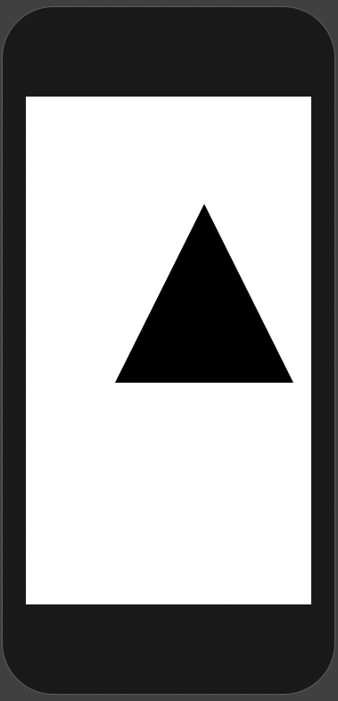
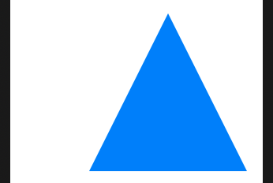
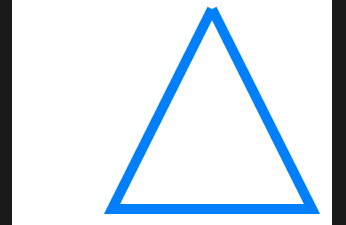

# Path

Low level construct for drawing custom shapes. One way to create a `Path` is to given it drawing instructions via a closure.

```swift
var body: some View {
    Path { path in
        path.move(to: CGPoint(x: 200, y: 100))
        path.addLine(to: CGPoint(x: 100, y: 300))
        path.addLine(to: CGPoint(x: 300, y: 300))
        path.addLine(to: CGPoint(x: 200, y: 100))
    }
}
```

Paths work off fixed coordinates.



## Color

```swift
.fill(Color.blue)
```



## Stroke and linewidth

```swift
.stroke(Color.blue, lineWidth: 10)
```



## Transparency

```swift
.stroke(Color.blue.opacity(0.25), lineWidth: 10)
```


## StrokeStyle

```swift
.stroke(Color.blue, style: StrokeStyle(lineWidth: 10, lineCap: .round, lineJoin: .round))
```


### Links that help

- [Custom Paths](https://www.hackingwithswift.com/books/ios-swiftui/creating-custom-paths-with-swiftui)