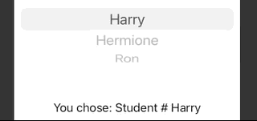

# Picker

This example uses a `ForEach` to view within a `Picker`. Nice thing about `ForEach` is it isn't hit that 10-view limit that we would of hit had we typed this by hand.


```swift
struct ContentView: View {
    let students = ["Harry", "Hermione", "Ron"]
    @State private var selectedStudent = 0

    var body: some View {
        VStack {
            Picker("Select your student", selection: $selectedStudent) {
                ForEach(0 ..< students.count) {
                    Text(self.students[$0])
                }
            }
            Text("You chose: Student # \(students[selectedStudent])")
        }
    }
}
```



## ForEach

Form with 100 rows.

```swift
Form {
    ForEach(0 ..< 100) { number in
        Text("Row \(number)")
    }
}
```

Or shorthand in a closure like this.

```swift
Form {
    ForEach(0 ..< 100) {
        Text("Row \($0)")
    }
}
```


### Links that help

- [Creating views in a loop](https://www.hackingwithswift.com/books/ios-swiftui/creating-views-in-a-loop)
