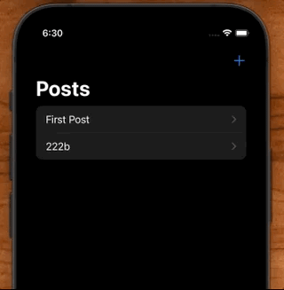
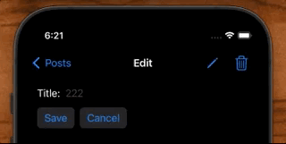
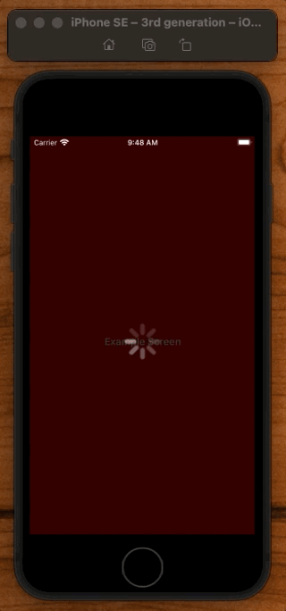

# ProgressView

## Pull to refresh



```swift
List(vm.posts) { post in
    NavigationLink(value: post) {
        Text(post.title)
    }
}
.refreshable {
    Task { await fetch() }
}
```

## Saving Button



```swift
struct EditPost: View {
    @State var isSaving = false

    var body: some View {
        Button {
            save()
        } label: {
            Text("Save")
                .opacity(isSaving ? 0 : 1)
                .overlay {
                    if isSaving {
                        ProgressView()
                    }
                }
        }
        .disabled(isSaving)
    }

    func save() {
        Task {
            isSaving = true
            await vm.updatePost(Post(...)
            isSaving = false
        }
    }
}
```

## Circular



```swift
struct ContentView: View {
    @State var isLoading = false

    var body: some View {
        ZStack {
            Color(.red)
                .ignoresSafeArea()
            Text("Example Screen")
                .bold()
                .foregroundColor(.white)

            if isLoading {
                LoadingView()
            }
        }
        .onAppear {
            startFakeNetworkCall()
        }
    }

    func startFakeNetworkCall() {
        isLoading = true
        DispatchQueue.main.asyncAfter(deadline: .now() + 3) {
            isLoading = false
        }
    }
}

struct LoadingView: View {
    var body: some View {
        ZStack {
            Color(.systemBackground)
                .ignoresSafeArea()
                .opacity(0.8)
            ProgressView()
                .progressViewStyle(.circular)
                .scaleEffect(3)
        }
    }
}
```

## Linear

A view that shows the progress towards completion of a task.


```swift
import SwiftUI

struct ContentView: View {
    
    @State private var progress = 0.5
    
    var body: some View {
        VStack {
            ProgressView(value: progress)
            Button("More", action: { progress += 0.05 })
        }
    }
}

struct ContentView_Previews: PreviewProvider {
    static var previews: some View {
        ContentView()
    }
}
```

### Links that help

- [Apple docs](https://developer.apple.com/documentation/swiftui/progressview)
