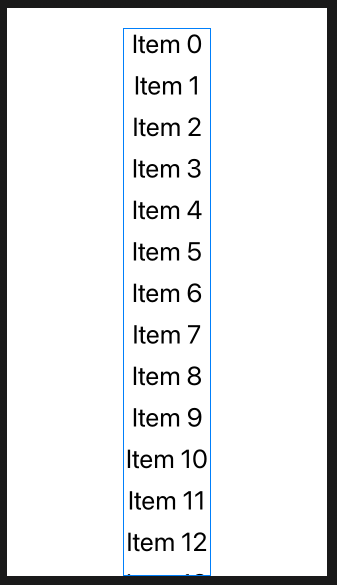
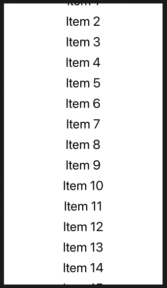

# ScrollView

Scroll views can scroll horizontally, vertically, or in both directions, and you can also control whether the system should show scroll indicators next to them – those are the little scroll bars that appear to give users a sense of how big the content is. When we place views inside scroll views, they automatically figure out the size of that content so users can scroll from one edge to the other.

As an example, we could create a scrolling list of 100 text views like this:

```
ScrollView(.vertical) {
    VStack(spacing: 10) {
        ForEach(0..<100) {
            Text("Item \($0)")
                .font(.title)
        }
    }
}
```



To make it wide we go like this:

```swift
ScrollView(.vertical) {
    VStack(spacing: 10) {
        ForEach(0..<100) {
            Text("Item \($0)")
                .font(.title)
        }
    }
    .frame(maxWidth: .infinity)
}
```



One important difference with scroll views is that the views you add get created immediately. Unlike `UITableViewController` which has an very efficient dequeing mechanism, scroll view create all views once created.

### Links that help

- [How scroll view lets us work with scrolling data](https://www.hackingwithswift.com/books/ios-swiftui/how-scrollview-lets-us-work-with-scrolling-data)