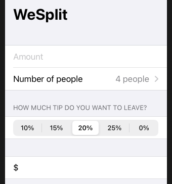

# Section

## Header

```swift
var body: some View {
    NavigationView {
        Form {
            Section {
                TextField("Amount", text: $checkAmount)
                    .keyboardType(.decimalPad)
                Picker("Number of people", selection: $numberOfPeople) {
                    ForEach(2 ..< 100) {
                        Text("\($0) people")
                    }
                }
            }
            
            Section(header: Text("How much tip do you want to leave?")) {
                Picker("Tip percentage", selection: $tipPercentage) {
                    ForEach(0 ..< tipPercentages.count) {
                        Text("\(self.tipPercentages[$0])%")
                    }
                }.pickerStyle(SegmentedPickerStyle())
            }
            
            Section {
                Text("$\(checkAmount)")
            }
        }.navigationBarTitle("WeSplit")
    }
}
```



### Links that help

- [Section Header](https://www.hackingwithswift.com/books/ios-swiftui/adding-a-segmented-control-for-tip-percentages)
