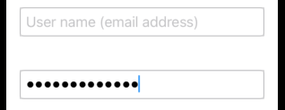

# SecureField



```swift
import SwiftUI

struct ContentView: View {

    @State private var username: String = ""
    @State private var password: String = ""

    var body: some View {
        TextField(
            "User name (email address)",
            text: $username)
            .autocapitalization(.none)
            .disableAutocorrection(true)
            .textFieldStyle(.roundedBorder)
            .border(Color(UIColor.separator))
            .padding()
        SecureField(
            "Password",
            text: $password
        ) {
//            handleLogin(username: username, password: password)
        }
        .border(Color(UIColor.separator))
        .textFieldStyle(RoundedBorderTextFieldStyle())
        .padding()
    }
}

struct ContentView_Previews: PreviewProvider {
    static var previews: some View {
        ContentView()
    }
}
```

### Links that help

- [Apple docs](https://developer.apple.com/documentation/swiftui/securefield)
