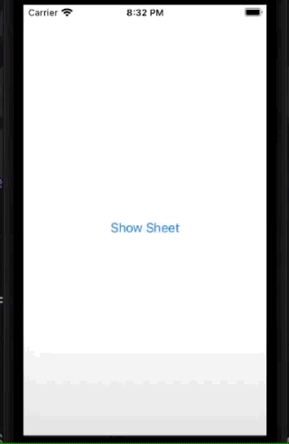

# Sheet

Modal sheet that can't be swiped to dismiss.

```swift
import SwiftUI

struct ExampleSheet: View {
    @Environment(\.presentationMode) var presentationMode // to dismiss ourselves
    
    var body: some View {
        VStack {
            Text("Sheet view")
            Button("Dismiss", action: close)
        }
        .interactiveDismissDisabled()
    }
    
    func close() {
        presentationMode.wrappedValue.dismiss()
    }
}

struct ContentView: View {
    @State private var showingSheet = false
    
    var body: some View {
        Button("Show Sheet") {
            showingSheet.toggle()
        }
        .sheet(isPresented: $showingSheet, content: ExampleSheet.init)
    }
}

struct ContentView_Previews: PreviewProvider {
    static var previews: some View {
        ContentView()
    }
}
```



You can bind the dismissal to a condition in the view.

```swift
import SwiftUI

struct ExampleSheet: View {
    @Environment(\.presentationMode) var presentationMode // to dismiss ourselves
    @State private var  termsAccepted = false
    
    var body: some View {
        VStack {
            Text("Terms & Conditions")
                .font(.title)
            Text("Lots of legalese here...")
            Toggle("Accept", isOn: $termsAccepted)
        }
        .padding()
        .interactiveDismissDisabled(!termsAccepted)
    }
    
    func close() {
        presentationMode.wrappedValue.dismiss()
    }
}

struct ContentView: View {
    @State private var showingSheet = false
    
    var body: some View {
        Button("Show Sheet") {
            showingSheet.toggle()
        }
        .sheet(isPresented: $showingSheet, content: ExampleSheet.init)
    }
}

struct ContentView_Previews: PreviewProvider {
    static var previews: some View {
        ContentView()
    }
}
```


