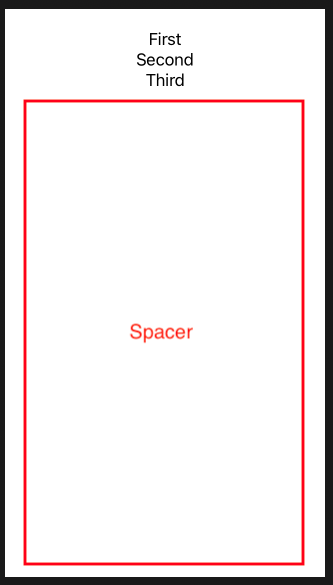
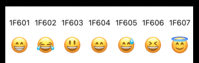
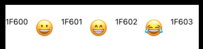

# Stacks

Every `View` needs to return one type of view. Which is why this is OK.

```swift
var body: some View {
    Text("Hello World")
}
```

But this isn't as it returns x2 views.

```swift
var body: some View {
    Text("Hello World")
    Text("This is another text view")
}
```

The way we get around this is with stacks.

## VStack

```swift
var body: some View {
    VStack {
        Text("Hello World")
        Text("This is inside a stack")
    }
}
```


```swift
VStack(alignment: .leading) {
    Text("Hello World")
    Text("This is inside a stack")
}
```


## HStack

```swift
HStack(spacing: 20) {
    Text("Hello World")
    Text("This is inside a stack")
}
```


## ZStack

`ZStack` arranges things by depth. It makes the views overlap.

```swift
ZStack {
    Text("Hello World")
    Text("This is inside a stack")
}
```


## Spacers

Vertical and horizontal stacks automatically fill their available space in the center. If you want to push the content to the side, you need to use a spacer.

These automatically take up all the remaining space. So if you add one at the end of a `VStack` it wil push all your views to the top of the screen.



## LazyHGrid

A container view that arranges its child views in a grid that grows horizontally, creating items only as needed.



```swift
import SwiftUI

struct ContentView: View {
    
    var rows: [GridItem] = Array(repeating: .init(.fixed(20)), count: 2)

    var body: some View {
        ScrollView(.horizontal) {
            LazyHGrid(rows: rows, alignment: .top) {
                ForEach((0...79), id: \.self) {
                    let codepoint = $0 + 0x1f600
                    let codepointString = String(format: "%02X", codepoint)
                    Text("\(codepointString)")
                        .font(.footnote)
                    let emoji = String(Character(UnicodeScalar(codepoint)!))
                    Text("\(emoji)")
                        .font(.largeTitle)
                }
            }
        }
    }
}

struct ContentView_Previews: PreviewProvider {
    static var previews: some View {
        ContentView()
    }
}
```

## LazyHStack

A view that arranges its children in a line that grows horizontally, creating items only as needed.



```swift
import SwiftUI

struct ContentView: View {

    var body: some View {
        ScrollView(.horizontal) {
            LazyHStack(alignment: .top, spacing: 10) {
                ForEach((0...79), id: \.self) {
                    let codepoint = $0 + 0x1f600
                    let codepointString = String(format: "%02X", codepoint)
                    Text("\(codepointString)")
                        .font(.footnote)
                    let emoji = String(Character(UnicodeScalar(codepoint)!))
                    Text("\(emoji)")
                        .font(.largeTitle)
                }
            }
        }
    }
}

struct ContentView_Previews: PreviewProvider {
    static var previews: some View {
        ContentView()
    }
}
```

- [Apple Docs](https://developer.apple.com/documentation/swiftui/lazyhstack)


### Links that help

- [Using stacks to arrange views](https://www.hackingwithswift.com/books/ios-swiftui/using-stacks-to-arrange-views)
