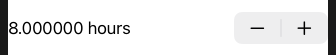

# Stepper

Smart enough to bind to any number (i.e. `Int`, `Double`). 

```swift
struct ContentView: View {
    
    @State private var sleepAmount = 8.0
    
    var body: some View {
        
        Stepper(value: $sleepAmount) {
            Text("\(sleepAmount) hours")
        }
        
    }
}
```



Limit range of steps like this.

```swift
Stepper(value: $sleepAmount, in: 4...12) {
    Text("\(sleepAmount) hours")
}
```

Adjust the step value.

```swift
Stepper(value: $sleepAmount, in: 4...12, step: 0.25) {
    Text("\(sleepAmount) hours")
}
```

Format `%f`.

```swift
Text("\(sleepAmount, specifier: "%.2f") hours")
```


Format `%g` removes insignificant zeros.

```swift
Text("\(sleepAmount, specifier: "%.2g") hours")
```


### Links that help

- [Entering numbers with Stepper](https://www.hackingwithswift.com/books/ios-swiftui/entering-numbers-with-stepper)
