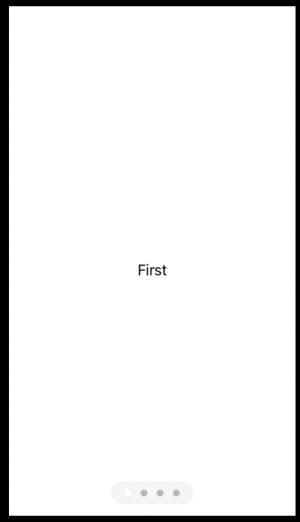

# TabView

SwiftUI’s TabView doubles up as the equivalent to a `UIPageViewController`, letting us swipe through multiple screens of content, with paging dots at the bottom to show users where they are.

## Tabs

```swift
struct ContentView: View {
    @State private var selection: Tab = .featured

    enum Tab {
        case featured
        case list
    }

    var body: some View {
        TabView(selection: $selection) {
            CategoryHome()
                .tabItem {
                    Label("Featured", systemImage: "star")
                }
                .tag(Tab.featured)

            LandmarkList()
                .tabItem {
                    Label("List", systemImage: "list.bullet")
                }
                .tag(Tab.list)
        }
    }
}
```

## Page Style

You can swipe.

```swift
import SwiftUI

struct ContentView: View {
    var body: some View {
        TabView {
            Text("First")
            Text("Second")
            Text("Third")
            Text("Fourth")
        }
        .tabViewStyle(.page)
        .indexViewStyle(.page(backgroundDisplayMode: .always))
    }
}

struct ContentView_Previews: PreviewProvider {
    static var previews: some View {
        ContentView()
    }
}
```



Hide the dots.

`.tabViewStyle(.page(indexDisplayMode: .never))`.

## Programmatically Selecting Tabs

1. Create an `@State` property to track the tab that is currently showing.
2. Modify that property to a new value whenever we want to jump to a different tab.
3. Pass that as a binding into the `TabView`, so it will be tracked automatically.
4. Tell SwiftUI which tab should be shown for each value of that property.


```swift
import SwiftUI

struct ContentView: View {
    @State private var selectedTab = 0
    
    var body: some View {
        TabView(selection: $selectedTab) {
            IntroView(selectedTab: $selectedTab).tag(0)
            FamilyNameView(selectedTab: $selectedTab).tag(1)
        }
        .tabViewStyle(.page)
        .indexViewStyle(.page(backgroundDisplayMode: .always))
    }
}

struct IntroView: View {
    @Binding var selectedTab: Int
    
    var body: some View {
        VStack {
            Text("Welcome").font(.title)
            Button("Next", action: next)
                .buttonStyle(.bordered)
        }
    }
    
    func next() {
        selectedTab = 1
    }
}

struct FamilyNameView: View {
    @Binding var selectedTab: Int
    
    var body: some View {
        VStack {
            Text("Enjoy").font(.title)
            Button("Back", action: back)
                .buttonStyle(.bordered)
        }
    }
    
    func back() {
        selectedTab = 0
    }
}

struct ContentView_Previews: PreviewProvider {
    static var previews: some View {
        ContentView()
    }
}
```

> Tip: It’s common to want to use NavigationView and TabView at the same time, but you should be careful: TabView should be the parent view, with the tabs inside it having a NavigationView as necessary, rather than the other way around.

### Links that help

- [Creating tabs with TabView and tabItem()](https://www.hackingwithswift.com/books/ios-swiftui/creating-tabs-with-tabview-and-tabitem)
- [How to create scrolling pages of content using tabViewStyle()](https://www.hackingwithswift.com/quick-start/swiftui/how-to-create-scrolling-pages-of-content-using-tabviewstyle)
- [Stack Overflow - Programmatic selection](https://stackoverflow.com/questions/62504400/programmatically-change-to-another-tab-in-swiftui)
