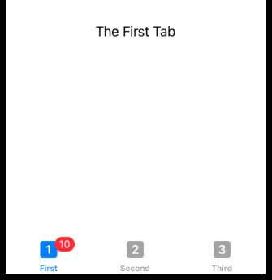

# TabView

SwiftUI’s TabView doubles up as the equivalent to a `UIPageViewController`, letting us swipe through multiple screens of content, with paging dots at the bottom to show users where they are.

## Tabs

```swift
import SwiftUI

struct ContentView: View {
    var body: some View {
        TabView {
            Text("The First Tab")
                .badge(10)
                .tabItem {
                    Image(systemName: "1.square.fill")
                    Text("First")
                }
            Text("Another Tab")
                .tabItem {
                    Image(systemName: "2.square.fill")
                    Text("Second")
                }
            Text("The Last Tab")
                .tabItem {
                    Image(systemName: "3.square.fill")
                    Text("Third")
                }
        }
    }
}

struct ContentView_Previews: PreviewProvider {
    static var previews: some View {
        ContentView()
    }
}
```



## Page Style

You can swipe.

```swift
import SwiftUI

struct ContentView: View {
    var body: some View {
        TabView {
            Text("First")
            Text("Second")
            Text("Third")
            Text("Fourth")
        }
        .tabViewStyle(.page)
        .indexViewStyle(.page(backgroundDisplayMode: .always))
    }
}

struct ContentView_Previews: PreviewProvider {
    static var previews: some View {
        ContentView()
    }
}
```


Hide the dots.

`.tabViewStyle(.page(indexDisplayMode: .never))`.

## Programmatically Selecting Tabs

1. Create an `@State` property to track the tab that is currently showing.
2. Modify that property to a new value whenever we want to jump to a different tab.
3. Pass that as a binding into the `TabView`, so it will be tracked automatically.
4. Tell SwiftUI which tab should be shown for each value of that property.

Steps 1-3 are easy. Step 4 is a bit more complicated. SwiftUI doesn't treat tabs as an array to be referenced by an index.

Instead you assign a unique identifier known as a `tag` to each tab, and access the tabs that way.

Here is how we can programmatically switch to Tab 2 after gesturing on Tab 1.

```swift
struct ContentView: View {
    @State private var selectedTab = 0

    var body: some View {
        TabView(selection: $selectedTab) {
            Text("Tab 1")
                .onTapGesture {
                    self.selectedTab = 1
                }
                .tabItem {
                    Image(systemName: "star")
                    Text("One")
                }
                .tag(0)

            Text("Tab 2")
                .tabItem {
                    Image(systemName: "star.fill")
                    Text("Two")
                }
                .tag(1)
        }
    }
}
```

> Tip: It’s common to want to use NavigationView and TabView at the same time, but you should be careful: TabView should be the parent view, with the tabs inside it having a NavigationView as necessary, rather than the other way around.

### Links that help

- [Creating tabs with TabView and tabItem()](https://www.hackingwithswift.com/books/ios-swiftui/creating-tabs-with-tabview-and-tabitem)
- [How to create scrolling pages of content using tabViewStyle()](https://www.hackingwithswift.com/quick-start/swiftui/how-to-create-scrolling-pages-of-content-using-tabviewstyle)
