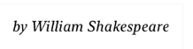

# Text

```swift
Text("Hamlet")
    .font(.title)
```


```swift
Text("by William Shakespeare")
    .font(.system(size: 12, weight: .light, design: .serif))
    .italic()
```



```swift
Text("To be, or not to be, that is the question:")
    .frame(width: 100)
```


```swift
Text("Brevity is the soul of wit.")
    .frame(width: 100)
    .lineLimit(1)
```


## Specifier

```swift
Text("\(temperature, specifier: "%.2f")") // x2 decimal
```

```swift
Text("\(temperature, specifier: "%.0f")") // 0 decimal
```

## submitLabel

```swift
struct ContentView: View {
    @State private var username = ""
    @State private var password = ""
    
    var body: some View {
        Form {
            TextField("Username", text: $username)
                .submitLabel(.continue)
            SecureField("Password", text: $password)
                .submitLabel(.done)
        }
    }
}
```

### Links that help

- [Apple docs Text](https://developer.apple.com/documentation/swiftui/text)
