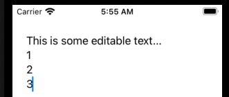

# TextEditingView



```swift
import SwiftUI

struct ContentView: View {
    @State private var fullText: String = "This is some editable text..."
    
    var body: some View {
        TextEditor(text: $fullText)
            .padding()
    }
}

struct ContentView_Previews: PreviewProvider {
    static var previews: some View {
        ContentView()
    }
}
```

### Links that help

- [Apple docs](https://developer.apple.com/documentation/swiftui/texteditor)
