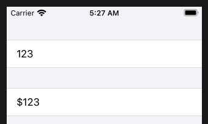

# TextField

```swift
struct ContentView: View {
    @State private var checkAmount = ""
    
    var body: some View {
        Form {
            Section {
                TextField("Amount", text: $checkAmount)
                    .keyboardType(.decimalPad)
            }

            Section {
                Text("$\(checkAmount)")
            }
        }
    }
}
```



### Links that help

- [Reading text from the user with TextField](https://www.hackingwithswift.com/books/ios-swiftui/reading-text-from-the-user-with-textfield)
