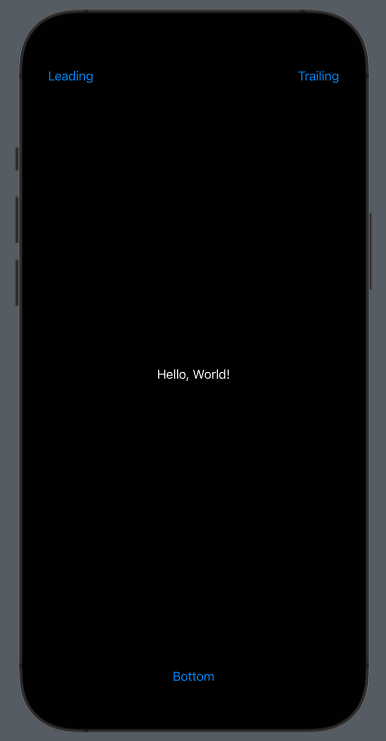
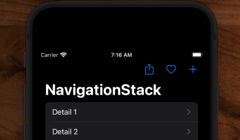

# Toolbar

## Single


```swift
import SwiftUI

struct ContentView: View {
    @State var showingAddItinerary = false

    var body: some View {
        NavigationStack {
            List(1..<20) { i in
                NavigationLink("Detail \(i)") {
                    Text("Detail \(i)")
                }
            }
            .navigationTitle("NavigationStack")
            .toolbar {
                Button(action: {
                    self.showingAddItinerary.toggle()
                }) {
                    Image(systemName: "plus")
                }
            }
            .sheet(isPresented: $showingAddItinerary) {
                Text("Add itinerary")
            }
        }
    }
}

struct ContentView_Previews: PreviewProvider {
    static var previews: some View {
        ContentView()
            .preferredColorScheme(.dark)
    }
}
```

## Single Placement



```swift
struct AddItineraryView: View {
    var body: some View {
        Text("Hello, World!")
            .toolbar {
                ToolbarItem(placement: .navigationBarTrailing) {
                    Button("Trailing") {
                        print("Trailing")
                    }
                }
                ToolbarItem(placement: .navigationBarLeading) {
                    Button("Leading") {
                        print("Pressed")
                    }
                }
                ToolbarItem(placement: .bottomBar) {
                    Button("Bottom") {
                        print("Pressed")
                    }
                }
            }
    }
}
```

## Multi



```swift
import SwiftUI

struct ContentView: View {
    @State var showingAddItinerary = false

    var body: some View {
        NavigationStack {
            List(1..<20) { i in
                NavigationLink("Detail \(i)") {
                    Text("Detail \(i)")
                }
            }
            .navigationTitle("NavigationStack")
            .toolbar {
                ToolbarItemGroup(placement: .navigationBarTrailing) {
                    Button(action: {
                        print("Share")
                    }) {
                        Image(systemName: "square.and.arrow.up")
                    }

                    Button(action: {
                        print("Like")
                    }) {
                        Image(systemName: "heart")
                    }
                    Button(action: {
                        self.showingAddItinerary.toggle()
                    }) {
                        Image(systemName: "plus")
                    }
                }
            }
            .sheet(isPresented: $showingAddItinerary) {
                Text("Add itinerary")
            }
        }
    }
}

struct ContentView_Previews: PreviewProvider {
    static var previews: some View {
        ContentView()
            .preferredColorScheme(.dark)
    }
}
```

## Full screen take over

```swift
struct ParentView: View {
    .fullScreenCover(isPresented: $showingAddItinerary) {
        AddItineraryView()
    }
}

struct AddItineraryView: View {
    var body: some View {
        NavigationStack {
            .toolbar {
                ToolbarItem(placement: .navigationBarTrailing) {
                    Button("Add") {
                        print("Trailing")
                    }
                }
                ToolbarItem(placement: .navigationBarLeading) {
                    Button("Cancel") {
                        print("Pressed")
                    }
                }
            }
            .navigationTitle("New Itinerary")
            .navigationBarTitleDisplayMode(.inline)
        }
    }
}
```


### Links that help

- [Paul](https://www.hackingwithswift.com/quick-start/swiftui/how-to-create-a-toolbar-and-add-buttons-to-it)