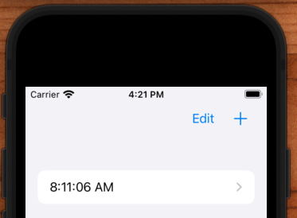
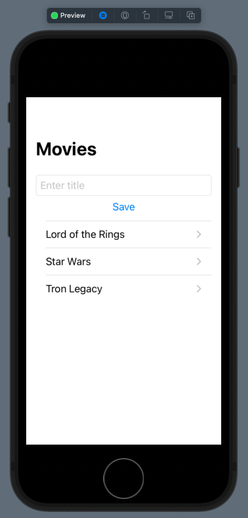
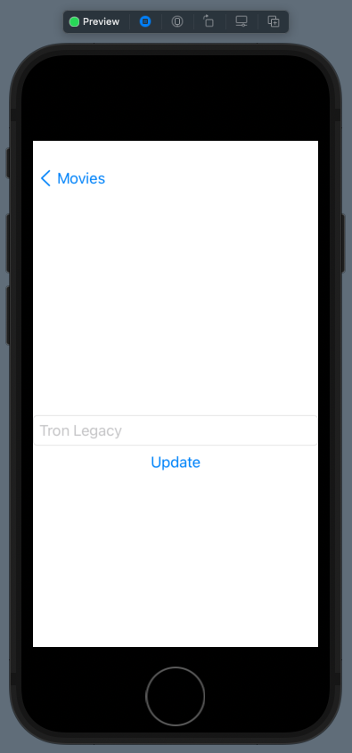

# CoreData Canonical Example






## Convenience wrapper and save in context 

**PersistenceController.swift**

```swift
import CoreData

struct PersistenceController {
    let container: NSPersistentContainer

    static let shared = PersistenceController()

    // Convenience
    var viewContext: NSManagedObjectContext {
        return container.viewContext
    }

    static var preview: PersistenceController = {
        let result = PersistenceController(inMemory: true)
        let viewContext = result.container.viewContext
        for _ in 0..<1 {
            let newItem = Item(context: viewContext)
            newItem.timestamp = Date()
        }
        shared.saveContext()
        
        return result
    }()

    init(inMemory: Bool = false) {
        container = NSPersistentContainer(name: "--REPLACEME--") // else UnsafeRawBufferPointer with negative count
        if inMemory {
            container.persistentStoreDescriptions.first!.url = URL(fileURLWithPath: "/dev/null")
        }
        container.loadPersistentStores(completionHandler: { (storeDescription, error) in
            if let error = error as NSError? {
                fatalError("Unresolved error \(error), \(error.userInfo)")
            }
        })
    }
    
    // Better save
    func saveContext() {
        let context = container.viewContext

        if context.hasChanges {
            do {
                try context.save()
            } catch {
                fatalError("Error: \(error.localizedDescription)")
            }
        }
    }
}
```

## Save when app goes to background

**App.swift**

```swift
import SwiftUI

@main
struct JRMoviesApp: App {
    @Environment(\.scenePhase) var scenePhase
    
    let persistenceController = PersistenceController.shared

    var body: some Scene {
        WindowGroup {
            ContentView()
                .environment(\.managedObjectContext, persistenceController.viewContext)
        }
        .onChange(of: scenePhase) { _ in
            persistenceController.saveContext()
        }
    }
}
```

## FetchRequest automatically refreshes the view

**ContentView.swift**

```swift
import SwiftUI
import CoreData

struct ContentView: View {
    @Environment(\.managedObjectContext) private var viewContext

    @FetchRequest(
        sortDescriptors: [NSSortDescriptor(keyPath: \Item.timestamp, ascending: true)],
        animation: .default)
    private var items: FetchedResults<Item>

    var body: some View {
        NavigationView {
            List {
                ForEach(items) { item in
                    NavigationLink(destination: ItemDetail(item: item)) {
                        Text("\(item.timestamp!, formatter: itemFormatter)")
                    }
                }
                .onDelete(perform: deleteItems)
            }
            .toolbar {
                HStack {
                    EditButton()
                    Button(action: addItem) {
                        Label("Add Item", systemImage: "plus")
                    }
                }
            }
        }
    }

    private func addItem() {
        withAnimation {
            let newItem = Item(context: viewContext)
            newItem.timestamp = Date()
            PersistenceController.shared.saveContext()
        }
    }

    private func deleteItems(offsets: IndexSet) {
        withAnimation {
            offsets.map { items[$0] }.forEach(viewContext.delete)
            PersistenceController.shared.saveContext()
        }
    }
}

let itemFormatter: DateFormatter = {
    let formatter = DateFormatter()
    formatter.dateStyle = .none
    formatter.timeStyle = .medium
    return formatter
}()

struct ContentView_Previews: PreviewProvider {
    static var previews: some View {
        ContentView().environment(\.managedObjectContext, PersistenceController.preview.viewContext)
    }
}
```

**Detail.swift**



```swift
import SwiftUI

struct ItemDetail: View {
    
    let item: Item
    
    @Environment(\.presentationMode) var presentationMode
    
    var body: some View {
        VStack {
            Text("\(item.timestamp!, formatter: itemFormatter)")
            Button("Update") {
                item.timestamp = Date()
                PersistenceController.shared.saveContext()
                presentationMode.wrappedValue.dismiss()
            }
            Spacer()
        }
    }
}

struct ItemDetail_Previews: PreviewProvider {
    static var previews: some View {
        let viewContext = PersistenceController.preview.container.viewContext
        let newItem = Item(context: viewContext)
        newItem.timestamp = Date()

        return ItemDetail(item: newItem)
            .environment(\.managedObjectContext, PersistenceController.preview.container.viewContext)
    }
}
```


### Links that help

- [One-to-many relationships with @FetchRequest and SwiftUI](https://www.youtube.com/watch?v=y1oWprQqLJY&ab_channel=PaulHudson)
